#三、面向对象（上）
##3.1 面向对象的概念
面向对象的特点主要可以概括为**封装性、继承性和多态性**。
面向对象的思想中提出两个概念，即**类和对象**。
类是对某一类事物的抽象描述。
对象用于表示现实中该类事物的个体，是类的具象化。所以对象是类的实例，一个类可以对应多个对象。

##3.2 类与对象
###3.2.1 类的定义
1. 类是对象的抽象，它用于描述一组对象的共同特征和行为。
类中可以定义**成员变量**和**成员方法**，其中**成员变量用于描述对象的特征**，也被称作属性；**成员方法用于描述对象的行为**，可简称为方法。
2. 类的定义示范
```
class Person{
    int age; //定义int类型的成员变量age
    void speak(){
        System.out.println("哈哈哈" + age);
    } //成员方法，可以直接访问成员变量age
}
```
###3.2.2 对象的创建与使用
1. 根据类创建实例对象
   ```
   类名 对象名称 = new 类名();
   Person p = new Person();
   ```
   “new Person()”用于创建Person类的一个实例对象，
“Person p”则是声明了一个Person类型的变量p。
中间的等号用于将Person对象在内存中的地址赋值给变量p，这样变量p便持有了对象的引用
 2.   对象的使用
```
public class example(){
    public static void main(String[] args){
        Person p1 = new Person();
        Person p2 = new Person();
        p1.age = 18;
        p1.speak();
        p2.speak();
    }
}
```
在创建Person对象后，可以通过对象的引用来访问对象所有的成员，具体格式如下：


3. 对象无法使用的情况
    1. 没有变量引用这个对象时，它将成为垃圾对象，不能再被使用。
    2. 变量超出作用域变为垃圾对象。
    3. 变量的值变为null(当一个变量的值为null时，则表示该变量不指向任何一个对象。在例程中，当把变量p置为null时，被p所引用的Person对象就会失去引用，成为垃圾对象。)

###3.2.3 类的设计
一般格式：
```
public class Student{
    String name;
    int age;
    public void introduce(){
        System.out.println("自我介绍下");
    }
}
```
但是这样的设计不能限制年龄的修改（负值就不太合理）。因此在设计一个类时，应该对成员变量的访问作出一些限定，不允许外界随意访问。这就需要实现类的封装。

###3.2.4 类的封装
类的封装是指在定义一个类时，将类中的属性私有化，即**使用private关键字来修饰，私有属性只能在它所在类中被访问**。
为了能让外界访问私有属性，**需要提供一些使用public修饰的公有方法，其中包括用于获取属性值的getXxx方法和设置属性值的setXxx方法**

一般例子：
```
class Student{
    private String name;
    private int age; //将name和age私有化封装
    public String getName(){
        return name;
    }
    public void setName(String stuName){
        name = stuName;
    }
    public int getAge(){
        return age;
    }
    public void setAge(int stuAge){
        if(stuAge < 0){
            System.out.println("不合法！");
        }
        else{
            age = stuAge;
        }
    }
    public void introduce(){
        System.out.println("自我介绍！");
    }
}

public class Example{
    public static void main(String[] args){
        Student stu = new Student();
        stu.setAge(30);
        stu.setName("李华");
        stu.introduce();
    }
}
```

##3.3 构造方法
### 3.3.1 构造方法的定义
1. 构造方法满足条件
    1. 方法名和类名相同
    2. **方法名的前面没有返回值类型的声明**
    3. 方法中不能使用return语句返回一个值

无参的构造方法
```
class Person{
    public Person(){
        System.out.println("无参方法调用");
    }
}
public class Example{
    public static void main(String[] args){
        Person p = new Person();
    }
}
```
有参的构造方法
```
class Person{
    int age;
    public Person(int a){
        age = a;
    }
    public void speak(){
        System.out.println("age");
    }
}
public class Example{
    public static void main(String[] agrs){
        Person p = new Person(20);
        p.speak();
    }
}
```
### 3.3.2 构造方法的重载
1. 构造方法也可以重载，在一个类中可以定义多个构造方法。
**只要每个构造方法的参数类型或参数个数不同即可**。
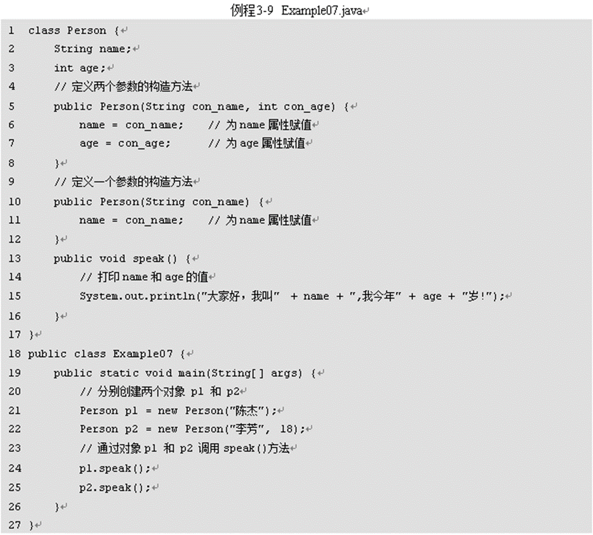
定义了两个构造方法，它们构成了重载。在创建p1对象和p2对象时，根据传入参数的不同，分别调用不同的构造方法。
两个构造方法对属性赋值的情况是不一样的，其中一个参数的构造方法只针对name属性进行赋值，这时age属性的值为默认值0。
2. 在Java中的每个类都至少有一个构造方法，**如果在一个类中没有定义构造方法，系统会自动为这个类创建一个默认的构造方法**，这个默认的构造方法没有参数，在其方法体中没有任何代码，即什么也不做。
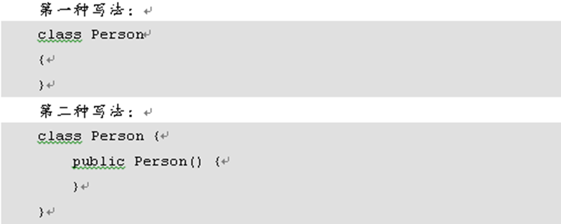
上面程序中Person类的两种写法效果是完全一样的。
1. **如果为该类定义了构造方法，系统就不再提供默认的构造方法了**,所以**如果没有定义无参的构造方法，只定义了一个有参的构造方法，系统将不再自动生成无参的构造方法**。那如果**调用无参的构造方法，会报错**！

##3.4 this关键字
1. 通过this关键字可以明确地去访问一个类的成员变量，**解决与局部变量名称冲突问题**。

在上面的代码中，构造方法的参数被定义为age，**它是一个局部变量**，**在类中还定义了一个成员变量，名称也是age**。在**构造方法中如果使用“age”，则是访问局部变量，但如果使用“this.age”则是访问成员变量**。
2. 通过this关键字调用成员方法。**这可以帮助更加明确地实现成员方法的互相调用**。

在上面的speak()方法中，使用this关键字调用openMouth()方法。注意，此处的this关键字可以省略不写，也就是说上面的第6行代码写成“this.openMouth()”和“openMouth()”，效果是完全一样的
3. **this 可以用于调用构造方法**。 可以在一个构造方法中使用“this([参数1,参数2…])”的形式来调用其它的构造方法通过this关键字调用成员方法。
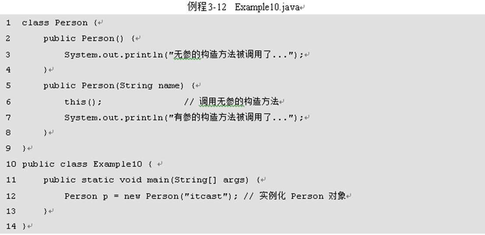

以上代码用有参的构造方法，但是里面有"this()"调用无参的构造方法。
但是需要**注意**的是：
    1. 只能在构造方法中使用this调用其它的构造方法。
    2. 在构造方法中，使用this调用构造方法的语句**必须位于第一行，且只能出现一次**。
    下面的写法是非法的：
    
    3. 不能在一个类的两个构造方法中使用this互相调用。
    下面的写法是非法的：
    

##3.5 垃圾回收
当一个对象成为垃圾后仍会占用内存空间，时间一长，就会导致内存空间的不足。针对这种情况，Java中引入了垃圾回收机制。
除了等待Java虚拟机进行自动垃圾回收，也可以通过调用System.gc()方法来通知Java虚拟机立即进行垃圾回收。当一个对象在内存中被释放时，它的finalize()方法会被自动调用
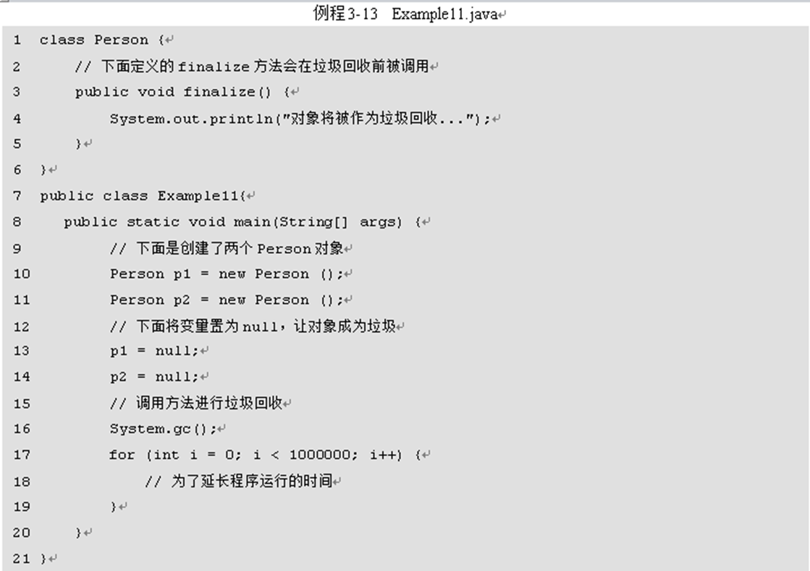
在例程3-13的Person类中定义了一个finalize()方法，**该方法的返回值必须为void，并且要使用public来修饰**。在main()方法中创建了两个对象p1和p2，然后**将两个变量置为null，这意味着新创建的两个对象成为垃圾了**，紧接着通过**System.gc() 语句通知虚拟机进行垃圾回收**。从运行结果可以看出，**虚拟机针对两个垃圾对象进行了回收，并在回收之前分别调用两个对象的finalize()方法**。
##3.6 static关键字
###3.6.1 静态变量
1. 在一个Java类中，可以使用static关键字来修饰**成员变量**，该变量被称作静态变量。
2. **静态变量被所有实例共享**，可以使用“**类名.变量名**”的形式来访问。
3. **static关键字只能用于修饰成员变量，不能用于修饰局部变量**。
下面的代码是非法的：

4. 一般例子：
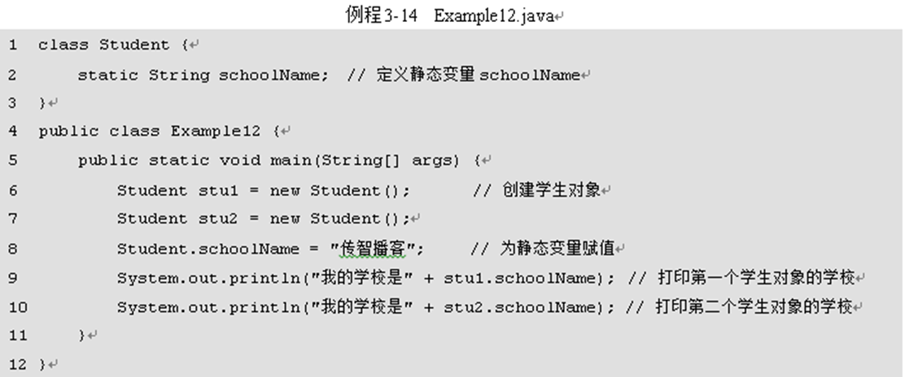
Student类中定义了一个**静态变量schoolName**，用于表示学生所在的学校，**它被所有的实例所共享**。在第8行代码将变量schoolName赋值为“传智播客”，**学生对象stu1和stu2的schoolName属性均为“传智播客”**。

###3.6.2 静态方法
1. 被static关键字修饰的方法称为静态方法
2. **一个静态方法中只能访问用static修饰的成员**。原因在于**没有被static修饰的成员需要先创建对象才能访问**，而**静态方法在被调用时可以不创建任何对象。**
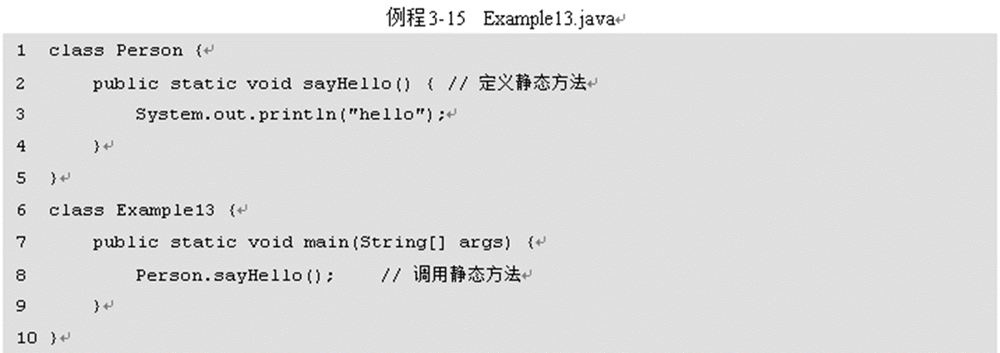
注意在**主函数里面还没有创建类，就已经可以调用类的静态方法**。由此可见**静态方法不需要创建对象就可以调用**。

###3.6.3 静态代码块
1. 在Java类中，使用一对大括号包围起来的若干行代码被称为一个代码块，**用static关键字修饰的代码块称为静态代码块**。
2. 类被加载时，静态代码块会执行，由于**类只加载一次，因此静态代码块只执行一次。**
3. **通常使用静态代码块来对类的成员变量进行初始化**
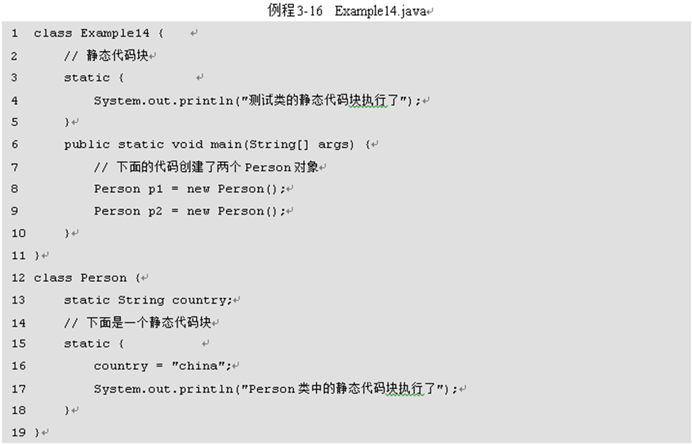
序中的两段静态代码块都执行了。在命令行窗口输入“java Example14”后，**虚拟机首先会加载类Example14，在加载类的同时就会执行该类的静态代码块**。在该方法中创建了两个Person对象，但在**两次实例化对象的过程中，静态代码块只执行一次**，这就说明**类在第一次使用时才会被加载，并且只会加载一次**


###3.6.4 单例模式
单例模式是Java中的一种设计模式，它是指**在设计一个类时，需要保证在整个程序运行期间针对该类只存在一个实例对象**。
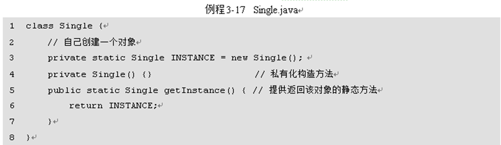
    1. **类的构造方法使用private修饰**，声明为私有，**这样就不能在类的外部使用new关键字来创建实例对象了**。
    2. 在类的内部创建一个该类的实例对象，并使用静态变量INSTANCE引用该对象，由于变量应该禁止外界直接访问，因此使用private修饰，声明为私有成员。
    3. **为了让类的外部能够获得类的实例对象，需要定义一个静态方法getInstance()**，用于返回该类实例INSTANCE。由于方法是静态的，外界可以通过“类名.方法名”的方式来访问

##3.7 内部类
###3.7.1 成员内部类
1. 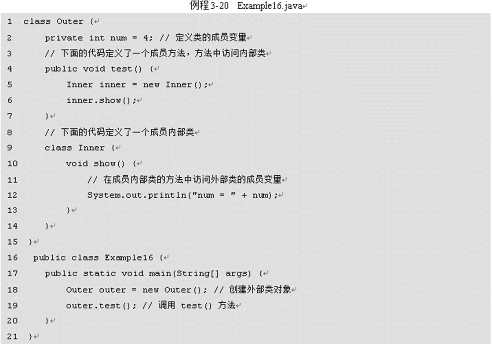
Outer类是一个外部类，在该类中定义了一个内部类Inner和一个test()方法，其中，Inner类有一个show()方法，**在show()方法中访问外部类的成员变量num**，**test()方法中创建了内部类Inner的实例对象，并通过该对象调用show()方法，将num值进行打印**。从运行结果可以看出，**内部类可以在外部类中被使用，并能访问外部类的成员**

2. 如果想通过外部类去访问内部类，则需要通过外部类对象去创建内部类对象。
   
   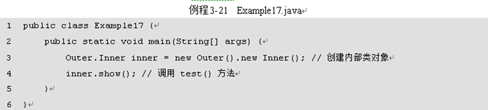
###3.7.2 静态内部类
可以使用static关键字来修饰一个成员内部类，该内部类被称作静态内部类，**它可以在不创建外部类对象的情况下被实例化。**


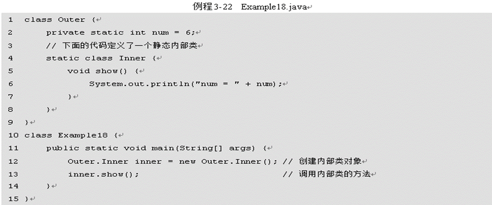
这主要要和3.7.1的2进行对比 并不需要实例化外部类就可以直接实例化。

###3.7.3 方法内部类
方法内部类是指在成员方法中定义的类，**它只能在当前方法中被使用。**
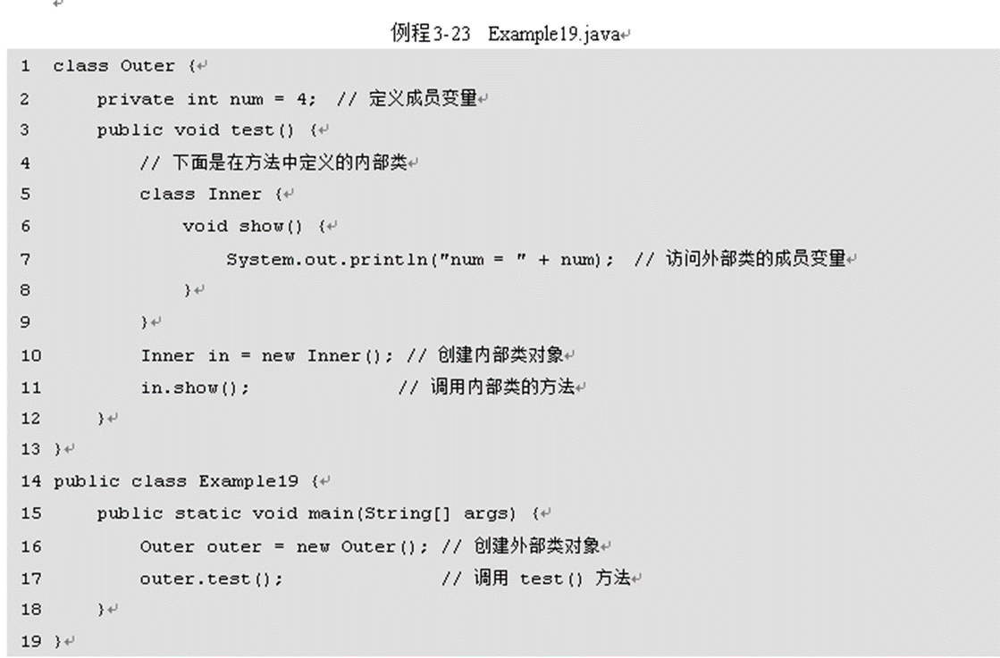
在Outer类的test()方法中定义了一个内部类Inner。**由于Inner是方法内部类，因此程序只能在方法中创建该类的实例对象并调用show()方法**。从运行结果可以看出，**方法内部类也可以访问外部类的成员变量num。**

##3.8 Java的帮助文档
###3.8.1 Java的文档注释
1. 文档注释用于是嵌入到程序当中的帮助信息，用于说明如何使用当前程序，它以“/**”开头，以“*/”标志结束
2. Java中提供了javadoc命令，它可以将这些帮助信息提取出来，自动生成HTML格式的帮助文档，从而实现程序的文档化
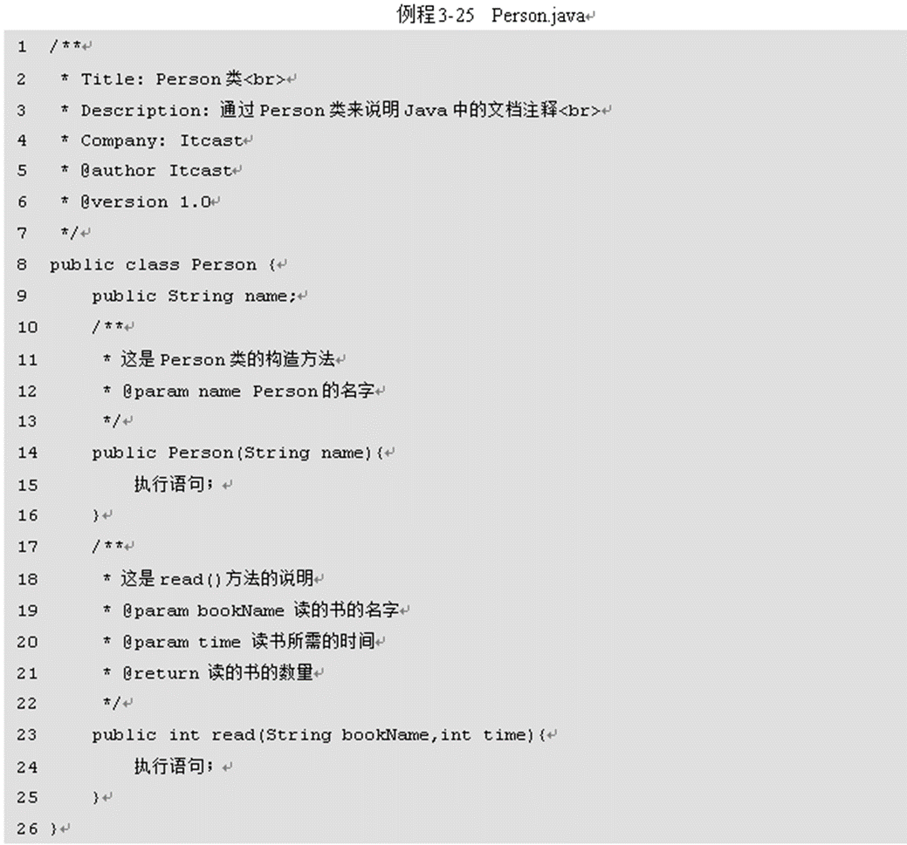
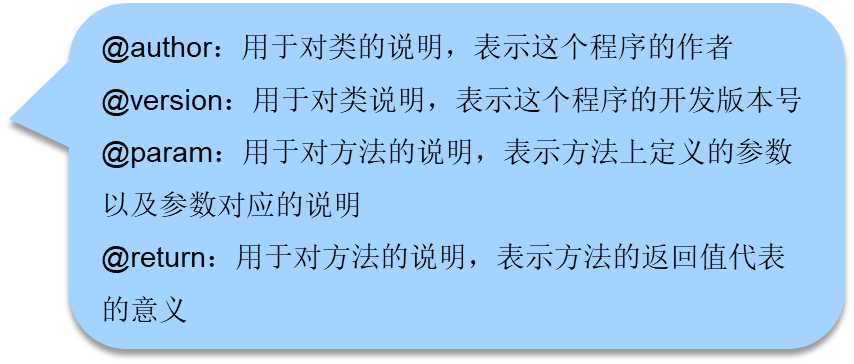
3. 为程序添加文档注释后，便可以使用javadoc命令生成Person类的帮助文档。打开命令行窗口，进入程序所在的目录，输入生成文档的命令，具体如下所示：

其中：
             -d 用来指定输出文档存放的目录
             . 表示当前的目录
             -version 用来指定输出文档中需包含版本信息
             -author 用来指定输出文档中需包含作者信息
###3.8.2 JDK帮助文档的使用
1. JDK帮助文档是Oracle公司针对JDK中所有的Java类提供的一整套帮助文档，它详细介绍了所有Java类的属性、方法、继承关系和示例用法等内容
2. JDK帮助文档通常有两种，一种是Oracle公司官方发布的HTML格式的JDK帮助文档，一种是由一些Java爱好者根据官方文档制作而成的CHM格式的JDK帮助文档。
