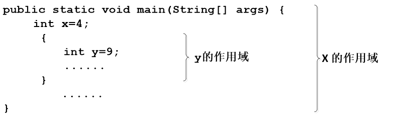
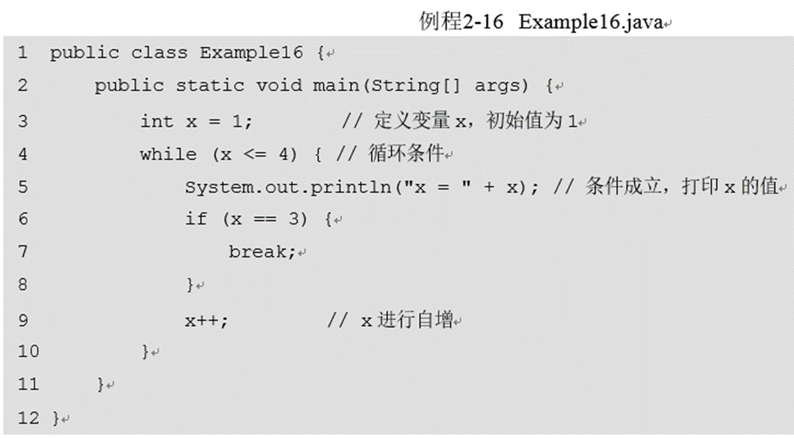

#二、Java编程基础
##2.1 Java基础语法
###2.1.1 基本格式
1. 一般格式
```
修饰符 class 类名{
    程序代码
}
```

2. 分号结束且严格区分大小写
```
System.out.println("...");
```
3. 层次结构
```
public class HelloWorld{
    public static void main(String args[]){
        System.out.println("...");
    }
}
```
4. Java可实现+号断行
   
###2.1.2 注释相关
   1. 单行注释： //
   2. 多行注释： /* ... */
   3. 文档注释： /** ... */
   4. 注意： 多行注释可以嵌套单行注释，但是多行注释无法嵌套多行注释(主要由于第一个/*会和第一个*/进行配对，导致编译失败)
   
###2.1.3 Java的标识符
1. 标识符（其实就是类似变量名之类的）可以由**大小写字母、数字、下划线以及美元符号$** 组成，但是 **数字无法作为开头！**
   例如不合法的有：123user，class， 98.3， Hello World
2. 包名：小写
   类名和接口名：首字母大写
   常量名：所有大写，单词之间下划线连接
   变量名和方法名：第一个单词首字母小写，之后单词首字母大写
###2.1.4 Java的关键字
1. 关键字即预定义的特殊含义单词，例如break,return,if 等
2. 所有关键字都是小写
###2.1.5 Java的常量
1. 常量即固定不变的量，包括整型变量，浮点数常量，布尔常量，字符常量等
2. 整型常量：二进制(0B,0b),八进制(0),十进制，十六进制(0x,0X)
3. 字符常量：例如 'n',其中'\u0000'表示一个空白字符
4. 字符串常量: "Helloworld"
5. 布尔常量：True 和 False
6. null常量：表示对象引用为空
###2.1.6 Java的反斜杠
1. \r 回车； \n 换行; \t 制表符; \b 退格符号
2. 转义: \' 单引号； \" 双引号； \\反斜杠
###2.1.7 Java的整型常量进制转换
1. 十进制转二进制

2. 二进制转十进制

3. 二进制转八进制

4. 二进制转十六进制


##2.2 Java的变量
###2.2.1 变量的定义
内存单元存储的临时数据；赋值操作会使得内存中的状态变化
###2.2.2 变量的数据类型
1. 数据类型

2. 整型数据变量 

**注意：long类型的变量赋值，需要在赋值的后面加上字母L**

3. 浮点型类型变量

**注意：为float变量赋值时需要在赋值后面一定加上F或者f；为double变量赋值时可以在赋值后面加上D或者d**
4. 字符类型变量（char）
用于存储单一字符，每个char类型的字符变量占2字节；
用单引号括起来；
对于char类型可以直接赋数值，会自动将其转换为字符，**例如 97与a等价**
5. 布尔类型变量
存储布尔值，即true和false
###2.2.3 变量的类型转换
1. 自动类型转化
   1. 数据类型保持兼容；**目标类型的取值范围大于源类型的取值范围！**
   例如：
    ```
    byte b = 3;
    int a = b; //这样可以保证数据无损
    ```
   2. 因此存在三种自动类型转化（总之向上赋值）：
        byte类型的数据可以赋值给short、int、long类型的变量，short、byte类型的数据可以赋值给int、long类型的变量，int类型的数据可以赋值给long类型的变量
        整数类型转换为float类型，如byte、char、short、int类型的数据可以赋值给float类型的变量。
        其它类型转换为double类型，如byte、char、short、int、long、float类型的数据可以赋值给double类型的变量
2. 强制类型转化（会造成数据溢出，有损）


出现这种现象的原因是，变量b为int类型，在内存中占用4个字节。byte类型的数据在内存中占用1个字节，当将变量b的类型强转为byte类型后，前面3个高位字节的数据丢失，数值发生改变。因此298变成了42

3. 表达式类型自动提升
变量在表达式中进行运算时，也有可能发生自动类型转换，这就是表达式数据类型的自动提升，如一个byte型的变量在运算期间类型会自动提升为int型。


图2-9中出现了错误，是因为在表达式b1+b2运算期间，变量b1和b2被自动提升为int型，表达式的运算结果也就成了int型，这时如果将该结果赋给byte型的变量就会报错，此时需要进行强制类型转换。

###2.2.4 变量的作用域
变量需要在它的作用范围内才可以被使用，这个作用范围称为变量的作用域。 变量一定会被定义在某一对大括号中，该大括号所包含的代码区域便是这个变量的作用域


##2.3 Java中的运算符
###2.3.1 算术运算符

1. 在进行自增（++）和自减（--）的运算时，如果运算符（++或--）放在操作数的前面则是先进行自增或自减运算，再进行其它运算。反之，如果运算符放在操作数的后面则是先进行其它运算再进行自增或自减运算。
   
定义了三个int类型的变量a、b、x。其中a=1、b=2。当进行“a+b++”运算时，**由于运算符++写在了变量b的后面，属于先运算再自增，因此变量b在参与加法运算时其值仍然为2，x的值应为3**。 变量b在参与运算之后会进行自增，因此**b的最终值为3**。
2. 当除数和被除数都为整数时，得到的结果也是一个整数。如果除法运算有小数参与，得到的结果会是一个小数。

结果为3000。由于表达式的执行顺序是从左到右，所以先执行除法运算3500/1000，得到结果为3，再乘以1000，得到的结果自然就是3000了
3. 在进行取模（%）运算时，**运算结果的正负取决于被模数(%左边的数)的符号**，与模数(%右边的数)的符号无关。如：(-5)%3=**-2**，而5%(-3)=**2**。
###2.3.2 赋值运算符

1. 在Java中可以通过一条赋值语句对多个变量进行赋值。

但是以下写法错误：

###2.3.3 比较运算符
比较运算符用于对两个数值或变量进行比较，其结果是一个布尔值，即true或false。比较运算符在使用时需要注意一个问题，不能将比较运算符“==”误写成赋值运算符“=”。


###2.3.4 逻辑运算符
1. 主要注意的是 异或符号^ 一致的为false，有差异的为true

2. 运算符“&”和“&&”都表示与操作，当且仅当运算符两边的操作数都为true时，其结果才为true，否则结果为false。
但是存在一定区别：
    1. 使用“&”进行运算时，不论左边为true或者false，右边的表达式都会进行运算。
    2. 使用“&&”进行运算，当左边为false时，右边的表达式不会进行运算，因此“&&”被称作短路与。
**这个例子很多说明问题：

这里的y自加成功，由于&两边都要计算
但这里的z没有自加成功，由于&&短路与 由于左边false，不在计算右侧的自加**
3. 运算符“|”和“||”都表示或操作，当运算符两边的操作数任何一边的值为true时，其结果为true，当两边的值都为false时，其结果才为false。同与操作类似，“||”表示短路或，当运算符“||”的左边为true时，右边的表达式不会进行运算。短路或的操作与短路与的操作类似
4. 运算符“^”表示异或操作，当运算符两边的布尔值相同时（都为true或都为false），其结果为false。当两边布尔值不相同时，其结果为true

###2.3.5 位运算符
1. 位运算符“^”是将参与运算的两个二进制数进行“异或”运算，如果二进制位相同，则值为0，否则为1。例如将6与11进行异或运算。

2. 位运算符“<<”就是将操作数所有二进制位向左移动一位。运算时，右边的空位补0。

3. 位运算符“>>“就是将操作数所有二进制位向右移动一位。运算时，左边的空位根据原数的符号位补0或者1（原来是负数就补1，是正数就补0）

4. 位运算符“>>>”就是将操作数所有二进制位向右移动一位。运算时，左边的空位补0（不考虑原数正负）。


##2.4 选择结构语句
###2.4.1 if 条件语句
1. 一般格式
```
public class example{
    public static void main(String [] args){
        int num = 19;
        if (num % 2 == 0){
            System.out.println("ou");
        }
        else{
            System.out.println("ji");
        }
    }
}
```
2. 三元运算
```
判断条件？表达式 1 ： 表达式 2
```

等价于
如果x>y max取x；否则max取y

3. 连续判断
```
if (判断条件 1){
    执行语句 1；
}
else if (判断条件 2){
    执行语句 2；
}
...
else if (判断条件 n){
    执行语句 n；
}
else {
    执行语句 n+1;
}
```
### 2.4.2 Switch **不考**
##2.5 循环结构语句
###2.5.1 while 循环语句
一般格式
```
public class expmple{
    public static void main(String [] args){
        int x = 1;
        while (x <= 4){
            System.out.println("x = " + x);
            x++;
        }
    }
}   
 ```
###2.5.2 do...while 循环语句
do …while循环和while循环能实现同样的功能。但是如果循环条件在循环语句开始时就不成立，那么while循环的循环体一次都不会执行，而do…while循环的循环体还是会执行一次。

### 2.5.3 for 循环语句
1. 与正常python和c++类似，
①表示初始化表达式、②表示循环条件、③表示操作表达式、④表示循环体，通过序号来具体分析for循环的执行流程。
2. 一般格式
```
public class example{
    public static void main(String [] args){
        int sum = 0;
        for (int i = 1; i <= 4; i++){
            sum += i;
        }
        System.out.println("sum = " + sum);
    }
}
```

### 2.5.4 循环嵌套
while、do…while、for循环语句都可以进行嵌套，并且它们之间也可以互相嵌套，如最常见的在for循环中嵌套for循环，格式如下。


### 2.5.5 跳转语句(break, continue)
1. break 语句
   
   当x等于3时直接跳出循环

2. continue 语句
   continue语句用在循环语句中，用于终止本次循环，执行下一次循环
   
   因此该代码只求解奇数和

## 2.6 方法
###2.6.1. 一般格式

方法中的“参数类型 参数名1，参数类型 参数名2”被称作参数列表，它用于描述方法在被调用时需要接收的参数，如果方法不需要接收任何参数，则参数列表为空，即()内不写任何内容   
方法的返回值必须为方法声明的返回值类型，如果方法中没有返回值，返回值类型要声明为void，此时，方法中return语句可以省略。

例子：
```
public class example{
    public static void main(String [] args){
        printRectangle(3,5);
    }
    
    public static void printRectangle(int height, int width){
        for (int i = 0; i < height; i++){
            for (int j = 0; j < width; j++){
                System.out.println("*");
            }
            System.out.println("\n");
        }
        System.out.println("\n");
    }
}
```
###2.6.2 方法的重载
1.重载
假设要在程序中实现一个对数字求和的方法，由于参与求和数字的个数和类型都不确定，因此要针对不同的情况去设计不同的方法。


例程2-23中定义了三个同名的add()方法，它们的参数个数或类型不同，从而形成了方法的重载。在main()方法中调用add()方法时，通过传入不同的参数便可以确定调用哪个重载的方法。
**注意： 方法的重载与返回值类型无关，它只有两个条件，一是方法名相同，二是参数个数或参数类型不相同。**
1. $\color{Red} {递归（必考）}$
一个方法的内部调用自身的过程；递归必须要有结束条件。


##2.7 数组
###2.7.1 数组定义
1. 在数组中存放任意类型的元素，同一个数组里存放的元素类型必须一致
```
int [] x = new int[100];
```
相当于在内存中定义了100个int类型的变量，第一个变量的名称为x[0]，第二个变量的名称为x[1]，以此类推，第100个变量的名称为x[99]，这些变量的初始值都是0。
```
int [] x;//声明一个int[]类型变量，提供数组的首地址
x = new int[100];//以x的首地址为始，顺延创建100元素的内存进行存储
```
2. 初始化

例子：
```
public class example{
    public static void main(String [] args){
        int[] arr = new int[4];
        arr[0] = 1;
        arr[1] = 2;
        System.out.println("arr[0]=” + arr[0]);
        System.out.println("arr[1]=” + arr[1]);
        System.out.println("arr[2]=" + arr[2]);
        System.out.println("arr[3]=” + arr[3]);
    }
}
```

3. 带初始化的数组定义
   
一般例子：
```
public class example{
    public static void main(String [] args){
        int[] arr = {1,2,3,4};
        System.out.println("arr[0]=” + arr[0]);
        System.out.println("arr[1]=” + arr[1]);
        System.out.println("arr[2]=" + arr[2]);
        System.out.println("arr[3]=” + arr[3]);        
    }
}
```
**注意：第三行代码只能写成```int[] arr = {1, 2, 3, 4}```,不能写成```int[] arr = new int[4]{1, 2, 3, 4}```,这样写编译器会报错,存在安全隐患**

4. 每个数组的索引都有一个范围，即0~length-1。在访问数组的元素时，索引不能超出这个范围，否则程序会报错
5. 使用变量引用一个数组时，变量必须指向一个有效的数组对象，如果该变量的值为null，则意味着没有指向任何数组，此时通过该变量访问数组的元素会出现空指针异常

###2.7.2 数组遍历
操作数组时，经常需要访问数组中的每个元素，这种操作称作数组的遍历
一般例子：
```
public class example{
    public static void main(String[] args){
        int[] arr = {4,1,6,3,9,8};
        int max = getMax(arr);
        System.out.println(max);
    }
    static int getMax(int[] arr){
        int max = arr[0];
        for (int x = 1; x < arr.length; x++){
            if (arr[x] > max){
                max = arr[x];
            }
        }
        return max;
    }
}
```

###2.7.3 数组排序(冒泡)
第一步，从第一个元素开始，将相邻的两个元素依次进行比较，直到最后两个元素完成比较。如果前一个元素比后一个元素大，则交换它们的位置。整个过程完成后，数组中最后一个元素自然就是最大值，这样也就完成了第一轮比较。
第二步，除了最后一个元素，将剩余的元素继续进行两两比较，过程与第一步相似，这样就可以将数组中第二大的数放在了倒数第二个位置。
第三步，以此类推，持续对越来越少的元素重复上面的步骤，直到没有任何一对元素需要比较为止。

```
public static void bubbleSort(int[] arr){
    for(int i = 0; i < arr.length-1; i++){
        for(int j = 0; j < arr.length-i-1; j++){
            if (arr[j] > arr[j+1]){
                int temp = arr[j];
                arr[j] = arr[j+1];
                arr[j+1] = temp;
            }
        }
    }
    System.out.println(arr);
}
```


###2.7.4 多维数组
1. ```int[][] arr = new int[3][4];```

2. ```int[][] arr = new int[3][];```

3. ```int[][] arr = {{1,2},{3,4,5,6},{7,8,9}};```

例子：
```
int[][] arr = new int [3][];
arr[0] = new int[] {11,12};
arr[1] = new int[] {21,22,23};
arr[2] = new int[] {31,32,33,34};
```