#五、多线程
##5.1 线程概述
###5.1.1 进程
1. 在一个操作系统中，每个独立执行的程序都可称之为一个进程，也就是“正在**进**行的**程**序”
2. 在计算机中，所有的应用程序都是由CPU执行的，对于一个CPU而言，在某个时间点只能运行一个程序，也就是说只能执行一个进程。

###5.1.2 线程
1. 每个运行的程序都是一个进程，在**一个进程中还可以有多个执行单元同时运行**，这些**执行单元**可以看做程序执行的一条条线索，被称为**线程**。
2. 当一个Java程序启动时，就会产生了一个进程，**该进程中会默认创建一个线程**，在这个线程上会运行main()方法中的代码。
3. 前面章节所接触过的程序中，代**码都是按照调用顺序依次往下执行**，没有出现两段程序代码交替运行的效果，这样的程序称作**单线程程序**。
**多段程序代码交替运行的效果，则需要创建多个线程，即多线程程序**。多线程程序在运行时，每个线程之间都是独立的，它们可以并发执行。
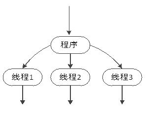

##5.2 线程的创建
单线程程序
```
public class Example{
    public static void main(String[] args){
        MyThread myThread = new MyThread();
        myThread.run();
        while(true){
            System.out.println("Main 方法正在进行");
        }
    }
}
class MyThread{
    public void run(){
        while(true){
            System.out.println("MyThread方法正在运行");
        }
    }
}
```
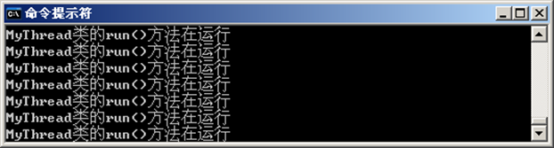
结果可以看出，程序一直打印的是“MyThread类的run()方法在运行”，这是因为该程序是一个单线程程序，当调用MyThread类的run()方法时，遇到死循环，循环会一直进行。

**如果希望两个while循环中的的打印语句能够并发执行，就需要实现多线程。**

###5.2.1 继承Thread类创建多线程
1. JDK中提供了一个线程类Thread，通过**继承Thread类，并重写Thread类中的run()方法**便可**实现多线程**。
2. 在Thread类中，提供了**start()方法用于启动新线程**，线程启动后，**系统会自动调用run()方法**，如果子类重写了该方法便会执行子类中的方法。

```
public class Example{
    public static void main(String[] args){
        MyThread myThread = new MyThread();
        myThread.start();
        while(true){
            System.out.println("main方法正在运行！")
        }

    }
}
class MyThread extends Thread{
    public void run() {
        while(true){
            System.out.println("MyThread方法正在运行中！")
        }
    }
}
```
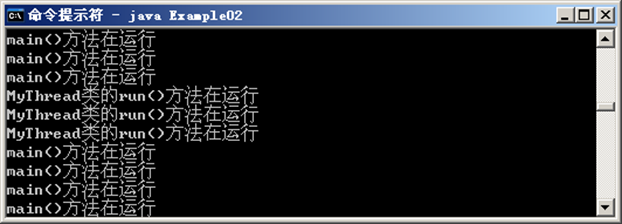
两个while循环中的打印语句轮流执行了，说明**该例程实现了多线程**
注意：单线程的程序在运行时，会按照代码的调用顺序进行执行。在多线程中，**main()方法和MyThread类的run()方法却可以同时运行，互不影响**，这正是单线程和多线程的区别。
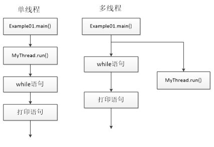
###5.2.2 实现Runnable接口创建多线程
通过继承Thread类实现了多线程，但是这种方式有一定的局限性。因为**Java中只支持单继承，一个类继承了某个父类就无法再继承Thread类**。
1. Thread类提供了另外一个构造方法**Thread(**Runnable target**)**，其中**Runnable是一个接口，它只有一个run()方法**。当通过Thread(Runnable target)构造方法创建线程对象时，只需为该方法**传递一个实现了Runnable接口的实例对象**，这样创建的线程将**调用实现了Runnable接口中的run()方法作为运行代码，而不需要调用Thread类中的run()方法**
```
public class Example{
    public static void main(String[] args){
        MyThread myThread = new MyThread()
        Thread thread = new Threable(myThread);
        thread.start();
        while(true){
            System.out.println("main方法在运行！");
        }
    }
}
class MyThread implements Runnable{
    public void run(){
        while(true){
            System.out.println("MyThread方法正在进行中");
        }
    }
}
```
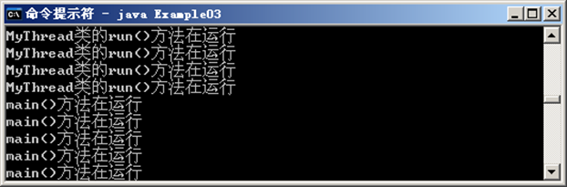
MyThread类**实现了Runnable接口**，并**重写了Runnable接口中的run()方法**，**通过Thread类的构造方法将MyThread类的实例对象作为参数传入**。从运行结果可以看出，main()方法和run()方法中的打印语句都执行了，说明例程实现了多线程。

###5.2.3 两种实现多线程方式的对比分析
1. 通过**继承Thread类的方式**来实现多线程的创建
```
public class Example{
    public static void main(String[] args){
        new TicketWindow().start();
        new TicketWindow().start();
        new TicketWindow().start();
        new TicketWindow().start();
    }
}
class TicketWindow extends Thread{
    private int tickets = 100;
    public void run(){
        while(true){
            if (tickets > 0){
                Thread th = Thread.currentThread();//获取当前线程
                String th_name = th.getName();//获取当前线程的名字
                System.out.println(th_name + tickets)
            }
        }
    }
}
```
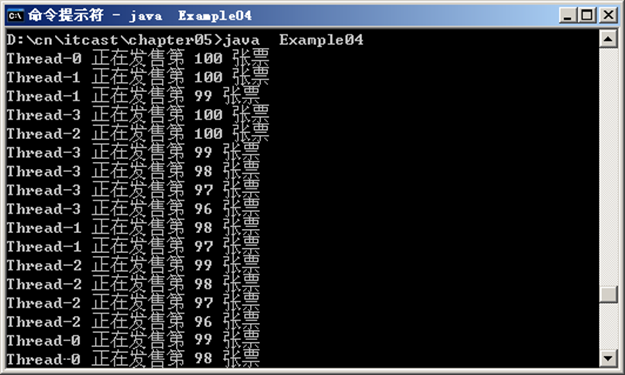
可以看出，每张票都被打印了四次。出现这样现象的原因是**四个线程没有共享100张票**，而是**各自出售了100张票**。在程序中**创建了四个TicketWindow对象，就等于创建了四个售票程序，每个程序中都有100张票，每个线程在独立地处理各自的资源。**
2. 为了保证资源共享，**在程序中只能创建一个售票对象**，然后开启**多个线程去运行这同一个售票对象的售票方法**，简单来说就是**四个线程运行同一个售票程序**，这时就需要用到多线程的第二种实现方式。
```
public class Example{
    public static void main(String[] args){
        TicketWindow tw = new TicketWindow();
        new Thread(tw, "窗口1").start();
        new Thread(tw, "窗口2").start();
        new Thread(tw, "窗口3").start();
        new Thread(tw, "窗口4").start();
    }
}
class TicketWindow implements Runnable{
    private int tickets = 100;
    public void run(){
        while(true){
            if (tickets > 0){
                Thread th = Thread.currentThread();//获取当前线程
                String th_name = th.getName();//获取当前线程的名字
                System.out.println(th_name + tickets)
            }
        }
    }
}
```
使用构造方法Thread(Runnable target, String name)在创建线程对象的同时指定线程的名称。
只创建了**一个TicketWindow对象**，然后创建了**四个线程**，在**每个线程上都去调用这个TicketWindow对象中的run()方法**，这样就可以确保**四个线程访问的是同一个tickets变量，共享100张车票**。

**总结：实现Runnable接口相对于继承Thread类来说，有如下显著好处**
    1. 适合**多个相同程序代码的线程去处理同一个资源的情况**，把线程同程序代码、数据有效的分离，很好的体现了面向对象的设计思想。
    2. 可以**避免由于Java的单继承带来的局限性**。在开发中经常碰到这样一种情况，就是使用一个已经继承了某一个类的子类创建线程，**由于一个类不能同时有两个父类，所以不能用继承Thread类的方式，那么就只能采用实现Runnable接口的方式。**
 
###5.2.4 后台线程
对Java程序来说，**只要还有一个前台线程在运行，这个进程就不会结束**，如果**一个进程中只有后台线程运行，这个进程就会结束**。**新创建的线程默认都是前台线程**，如果**某个线程对象在启动之前调用了setDaemon(true)语句，这个线程就变成一个后台线程。**
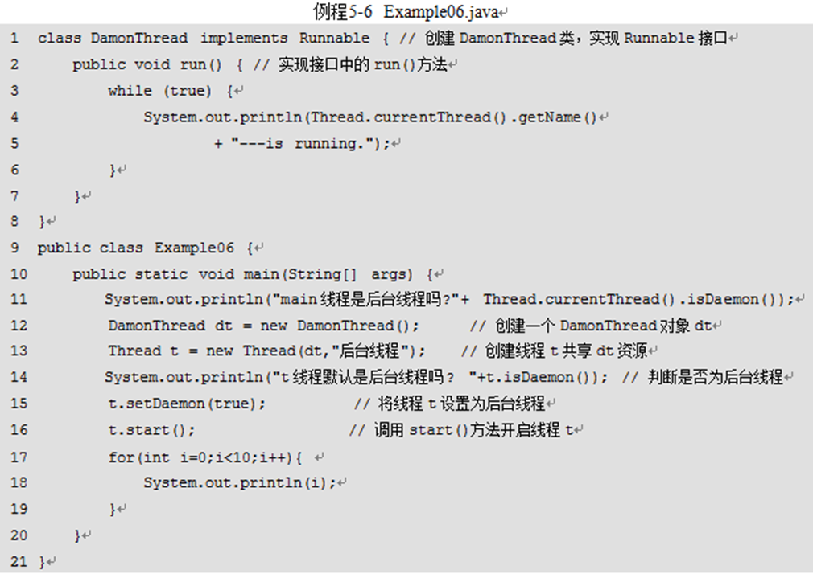
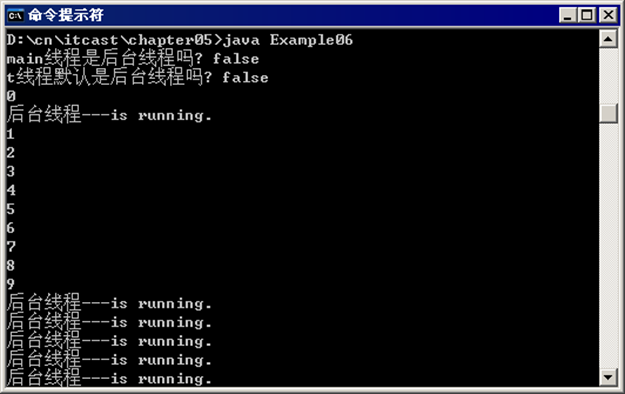
当开启线程t后，会执行死循环中的打印语句，但我们**将线程t设置为后台线程**后，**当前台线程死亡后，JVM会通知后台线程**。由于**后台线程从接受指令，到作出响应，需要一定的时间，因此，打印了几次“后台线程---is running.”语句**后，**后台线程也结束了**。由此说明进程中只有后台线程运行时，进程就会结束。
##5.3 线程的生命周期及状态转换
线程整个生命周期可以分为**五个阶段**，分别是**新建状态**(New)、**就绪状态**(Runnable)、**运行状态**(Running)、**阻塞状态**(Blocked)和**死亡状态**(Terminated)，线程的不同状态表明了线程当前正在进行的活动。
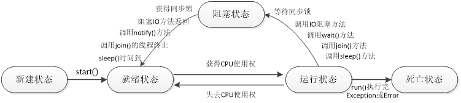
各种状态的转换关系，箭头表示可转换的方向，其中，**单箭头表示状态只能单向的转换**，比如线程只能从新建状态转换到就绪状态，反之则不能，**双箭头表示两种状态可以互相转换**，比如就绪状态和运行状态可以互相转换。
1. **新建状态(New)**
创建一个线程对象后，**该线程对象就处于新建状态，此时它不能运行**，和其它Java对象一样，仅仅由Java虚拟机为其分配了内存，没有表现出任何线程的动态特征。
2. **就绪状态(Runnable)**
当**线程对象调用了start()方法后，该线程就进入就绪状态（也称可运行状态）**。处于就绪状态的线程位于可运行池中，此时**它只是具备了运行的条件**，**能否获得CPU的使用权开始运行，还需要等待系统的调度。**
3. **运行状态(Running)**
**如果处于就绪状态的线程获得了CPU的使用权，开始执行run()方法中的线程执行体**，则**该线程处于运行状态**。当一个线程启动后，它不可能一直处于运行状态(除非它的线程执行体足够短，瞬间就结束了)，当**使用完系统分配的时间后，系统就会剥夺该线程占用的CPU资源，让其它线程获得执行的机会**。需要注意的是，**只有处于就绪状态的线程才可能转换到运行状态。**
4. **阻塞状态(Blocked)**
一个正在执行的线程在某些特殊情况下，如**执行耗时的输入/输出操作时，会放弃CPU的使用权，进入阻塞状态**。线程进入阻塞状态后，就不能进入排队队列。**只有当引起阻塞的原因被消除后，线程才可以转入就绪状态。**
阻塞状态的可能情形：
    1. 当线程试图**获取某个对象的同步锁**时，如果**该锁被其它线程所持有，则当前线程会进入阻塞状态**，如果想从阻塞状态进入就绪状态必须得获取到其它线程所持有的锁。
    2. 当线程调用了**一个阻塞式的IO方法时，该线程就会进入阻塞状态**，如果想进入就绪状态就必须要等到这个阻塞的IO方法返回。
    3. 当**线程调用了某个对象的wait()方法时，也会使线程进入阻塞状态**，如果想进入就绪状态就需要使用notify()方法唤醒该线程。
    4. 当**线程调用了Thread的sleep(long millis)方法时，也会使线程进入阻塞状态**，在这种情况下，**只需等到线程睡眠的时间到了以后，线程就会自动进入就绪状态。**
    5. 当在**一个线程中调用了另一个线程的join()方法时，会使当前线程进入阻塞状态**，在这种情况下，需要等到新加入的线程运行结束后才会结束阻塞状态，进入就绪状态。
5. **死亡状态(Terminated)**
线程的**run()方法正常执行完毕**或者**线程抛出一个未捕获的异常(Exception)、错误(Error)，线程就进入死亡状态**。一旦进入死亡状态，线程将不再拥有运行的资格，也不能再转换到其它状态。

##5.4 线程的调度
###5.4.1 线程的优先级
1. **优先级越高的线程**获得**CPU执行的机会越大**，而**优先级越低的线程**获得**CPU执行的机会越小。**
2. 线程的优先级用1~10之间的整数来表示，数字越大优先级越高。除了可以直接使用数字表示线程的优先级，还可以**使用Thread类中提供的三个静态常量表示线程的优先级**。

3. 程序在运行期间，**就绪状态的每个线程都有自己的优先级**，例如main线程具有普通优先级。然而**线程优先级不是固定不变的**，可以通过**Thread类的setPriority(int newPriority)方法对其进行设置**，该方法中的参数newPriority接收的是**1~10之间的整数**或者**Thread类的三个静态常量**。

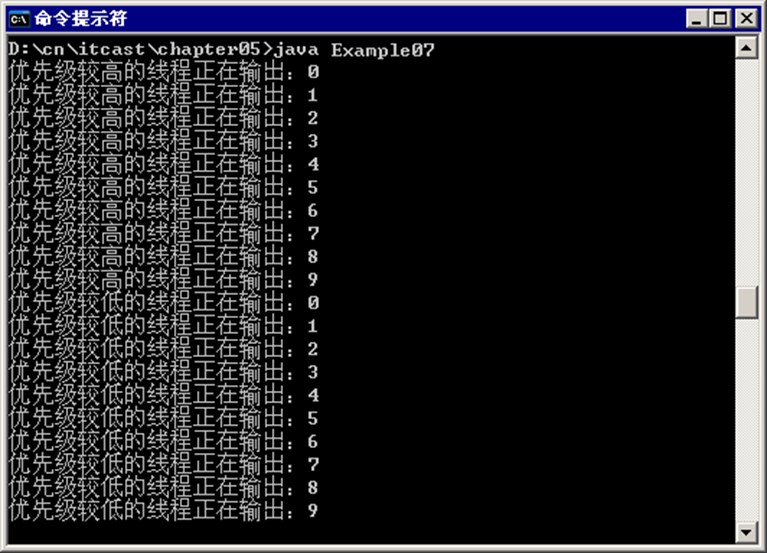
创建了两个线程minPriority和maxPriority，分别将线程的优先级设置为1和10，从运行结果可以看出，**优先级较高的maxPriority线程会先运行，运行完毕后优先级较低的minPriority线程才开始运行**。

###5.4.2 线程休眠
1. 如果希望人为地控制线程，**使正在执行的线程暂停，将CPU让给别的线程**，这时可以**使用静态方法sleep(long millis)**，该方法可以**让当前正在执行的线程暂停一段时间，进入休眠等待状态**。
2. 当前线程调用**sleep(long millis)**方法后，**在指定时间(参数millis)内该线程是不会执行的**，这样其它的线程就可以得到执行的机会了。
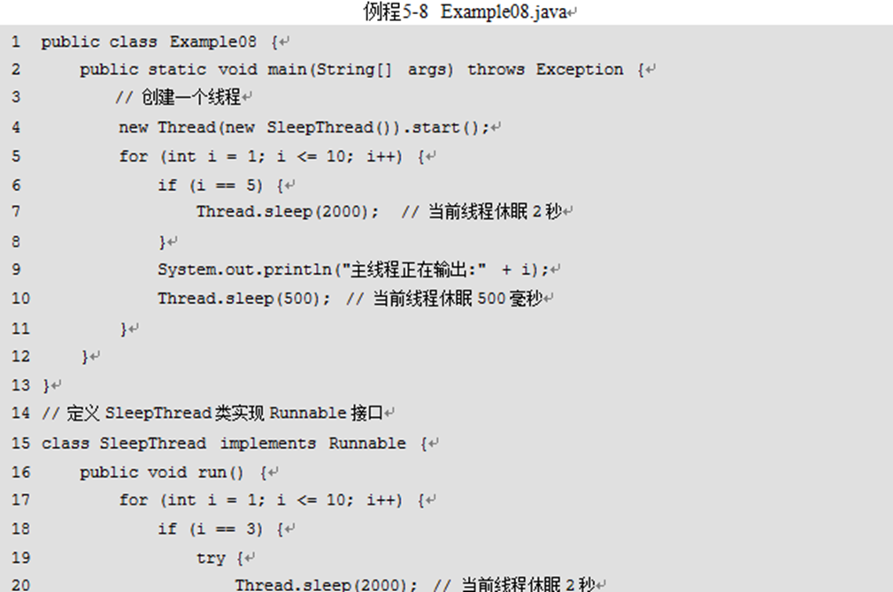
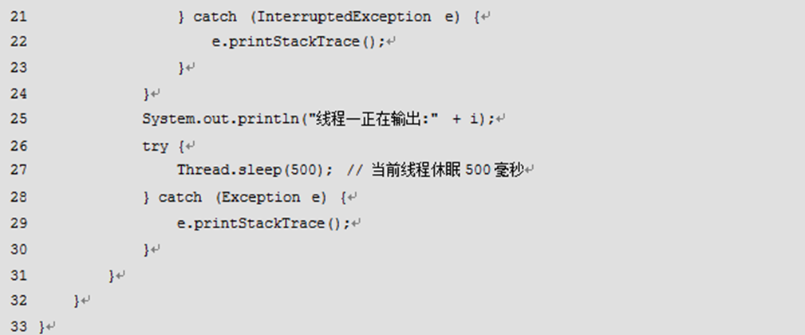
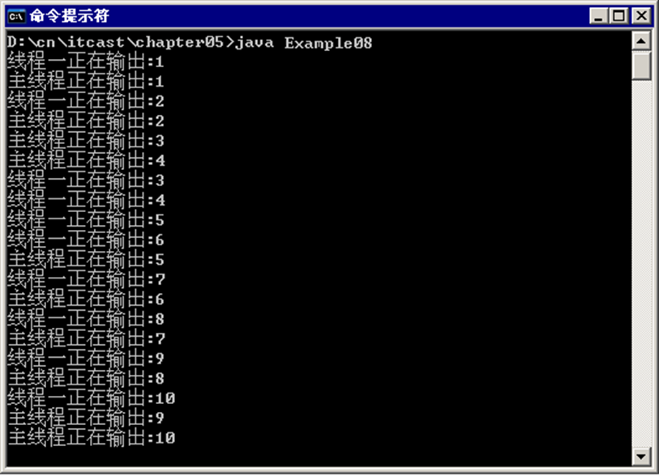
例程5-8中开启了两个线程（**主线程和新开的一个线程**，**主线程也是一个线程**），在这两个线程中分别调用了Thread的sleep(500)方法(代码的第10行和第27行)，目的是让一个线程在打印一次后休眠500毫秒，从而使另一个线程获得执行的机会，这样就可以实现两个线程的交替执行。
在线程一的for循环中，当i等于3时，调用了Thread的sleep(2000)方法(代码的第20行)，使线程休眠2秒钟。从运行结果可以看出，**主线程输出2后，线程一没有交替输出3，而是主线程接着输出了3和4，这说明了线程一进入了休眠等待状态。**
在主线程的for循环中，当i等于5时，也调用了Thread的sleep(2000)方法(代码的第7行)，使线程休眠2秒钟。**从运行结果可以看出，在主线程输出4后，下面连续4句话都是线程一输出的。只有当主线程2秒钟休眠完毕后，两个线程才会恢复交替执行。**
###5.4.3 线程让步
1. 在校园中，我们经常会看到同学互相抢篮球，当某个同学抢到篮球后就可以拍一会，之后他会把篮球让出来，大家**重新开始抢篮球**，这个过程就相当于**Java程序中的线程让步**。
2. 线程让步可以通过yield()方法来实现，该方法和sleep()方法有点相似，都可以让当前正在运行的线程暂停，区别在于**yield()方法不会阻塞该线程，它只是将线程转换成就绪状态**，让**系统的调度器重新调度一次**。当某个线程调用yield()方法之后，**只有与当前线程优先级相同或者更高的线程才能获得执行的机会。**

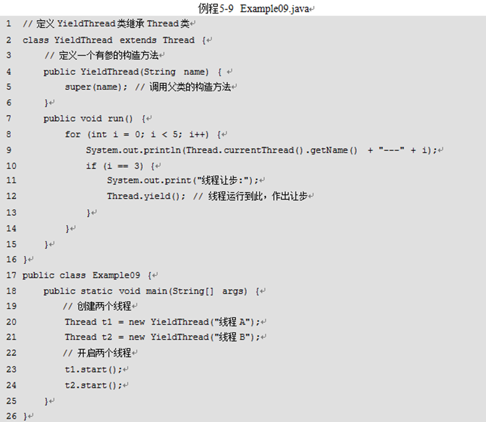
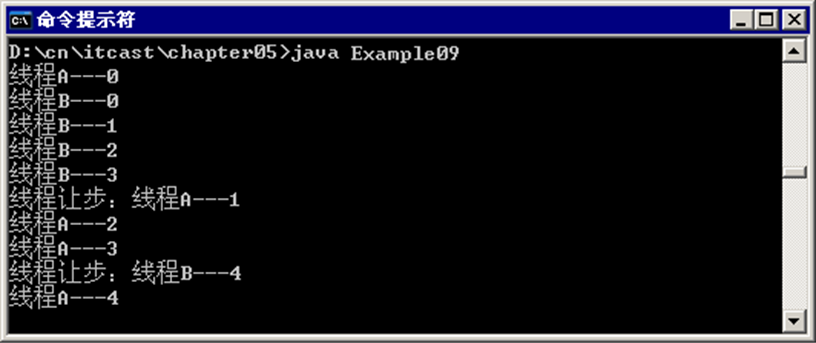
例程5-9中创建了两个线程t1和t2，它们的优先级相同。**两个线程在循环变量i等于3时，都会调用Thread的yield()方法，使当前线程暂停，这时另一个线程就会获得执行**，从运行结果可以看出，**当线程B输出3以后，会做出让步，线程A继续执行，同样，线程A输出3后，也会做出让步，线程B继续执行。**
###5.4.4 线程插队
1. 现实生活中经常能碰到“插队”的情况，同样，在Thread类中也提供了一个join()方法来实现这个“功能”。
2. 当在**某个线程中调用其它线程的join()方法**时，**调用的线程将被阻塞**，直到**被join()方法加入的线程执行完成后它才会继续运行。**
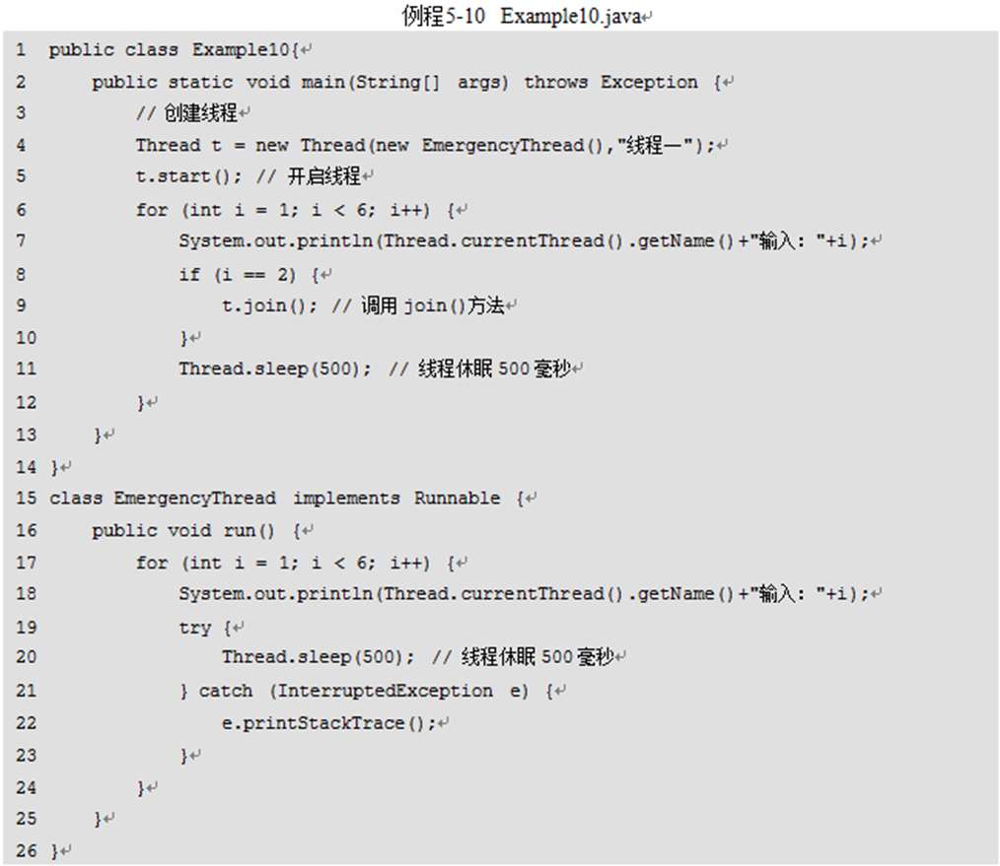
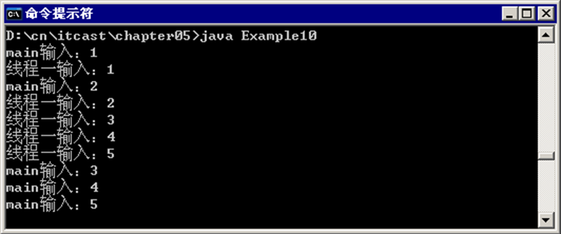
例程5-10中，在main线程中开启了一个线程t，两个线程的循环体中都调用了Thread的sleep(500)方法，以实现两个线程的交替执行。**当main线程中的循环变量为2时，调用t线程的join()方法**，这时，**t线程就会“插队”优先执行**。从运行结果可以看出，**当main线程输出2以后，线程一就开始执行，直到线程一执行完毕，main线程才继续执行**。
##5.5 多线程同步
###5.5.1 线程安全
例程5-5中的售票案例，极有可能碰到“意外”情况，如一张票被打印多次，或者打印出的票号为0甚至负数。**这些“意外”都是由多线程操作共享资源ticket所导致的线程安全问题**
针对例程5-5进行修改，模拟四个窗口出售10张票，**并在售票的代码中每次售票时线程休眠10毫秒**
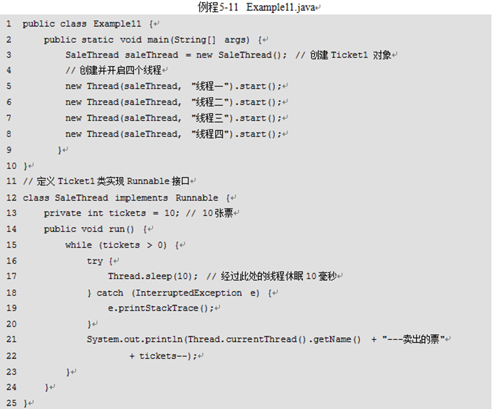
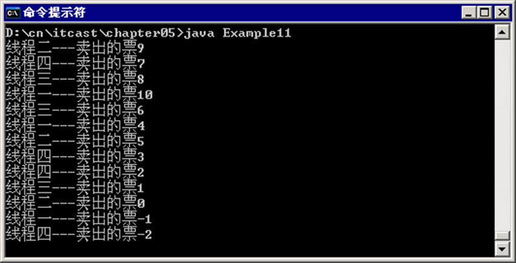
最后几行打印售出的票为0和负数，这种现象是不应该出现的，因为在售票程序中做了判断只有当票号大于0时才会进行售票。运行结果中之所以出现了负数的票号是因为**多线程在售票时出现了安全问题。**
在售票程序的while循环中添加了sleep()方法，这样就模拟了售票过程中线程的延迟。由于线程有延迟，当票号减为1时，**假设线程1此时出售1号票，对票号进行判断后，进入while循环，在售票之前通过sleep()方法让线程休眠**，这时线程二会进行售票，由于**此时票号仍为1，因此线程二也会进入循环，同理，四个线程都会进入while循环**，休眠结束后，四个线程都会进行售票，这样就**相当于将票号减了四次，结果中出现了0、-1、-2这样的票号**
###5.5.2 同步代码块
1. 要想解决例程5-11中的线程安全问题，必须得保证下面用于处理共享资源的代码在任何时刻只能有一个线程访问。
2. 为了实现这种限制，**Java中提供了同步机制**。当多个线程使用同一个共享资源时，可以将处理共享资源的代码放置在一个代码块中，**使用synchronized关键字来修饰，被称作同步代码块**，其语法格式如下：

**lock是一个锁对象，它是同步代码块的关键**。当线程执行同步代码块时，首先会**检查锁对象的标志位，默认情况下标志位为1**，**此时线程会执行同步代码块，同时将锁对象的标志位置为0**。当一个新的线程执行到这段同步代码块时，由于**锁对象的标志位为0，新线程会发生阻塞，等待当前线程执行完同步代码块后，锁对象的标志位被置为1，新线程才能进入同步代码块执行其中的代码**。循环往复，直到共享资源被处理完为止。
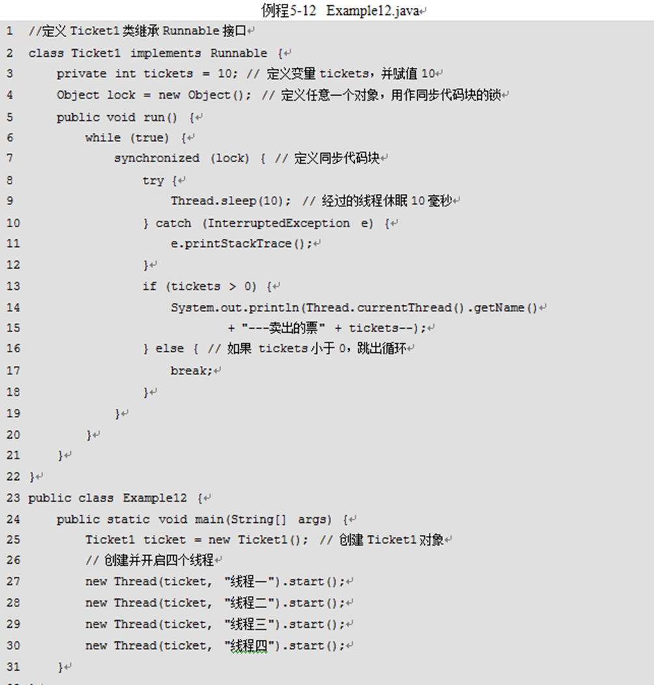
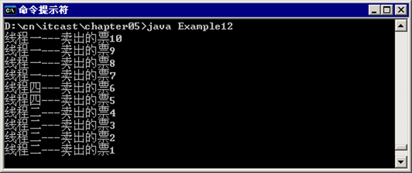
例程5-12中，将有关tickets变量的操作全部都放到同步代码块中。**为了保证线程的持续执行，将同步代码块放在死循环中，直到ticket<0时跳出循环**。因此，从图5-16所示的运行结果可以看出，售出的票**不再出现0和负数的情况**，这是因为售票的代码实现了同步，之前出现的线程安全问题得以解决。
###5.5.3 同步方法
1. 同步代码块可以有效解决线程的安全问题，当把共享资源的操作放在synchronized定义的区域内时，便为这些操作加了同步锁。**在方法前面同样可以使用synchronized关键字来修饰，被修饰的方法为同步方法，它能实现和同步代码块同样的功能**。

被**synchronized修饰的方法在某一时刻只允许一个线程访问**，访问该方法的其它线程都会发生阻塞，直到当前线程访问完毕后，其它线程才有机会执行方法。
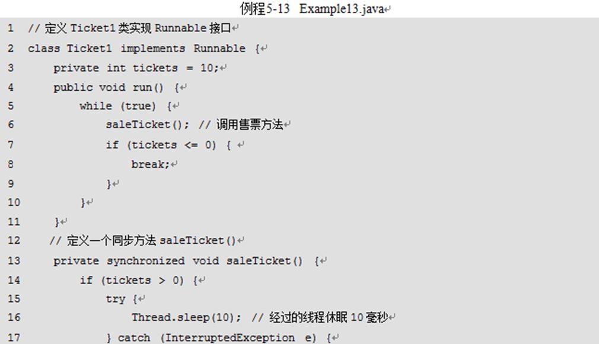
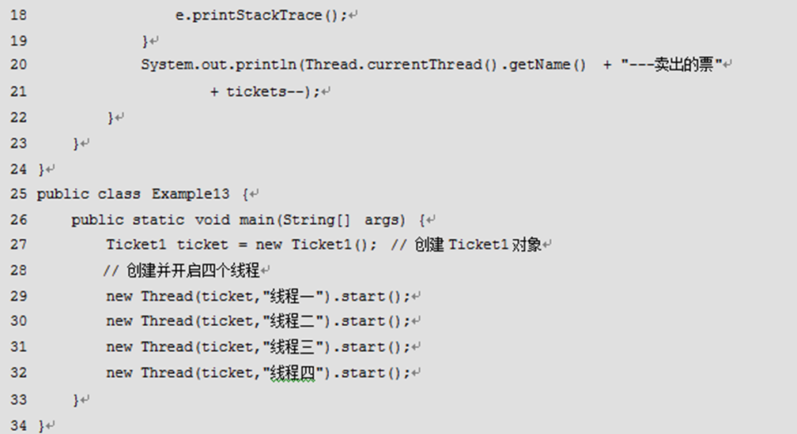
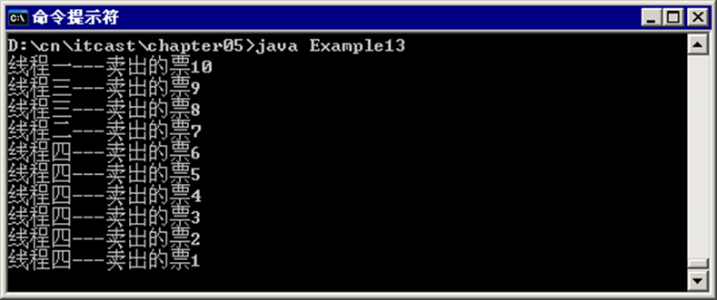
例程5-13中，将售票代码抽取为售票方法saleTicket()，并**用synchronized关键字把saleTicket()修饰为同步方法，然后在run()方法中调用该方法**。从图5-17所示的运行结果可以看出，同样没有出现0号和负数号的票，说明**同步方法实现了和同步代码块一样的效果。**
###5.5.4 死锁问题

结果可想而知，两个人都吃不到饭。这个例子中的中国人和美国人相当于不同的线程，筷子和刀叉就相当于锁。**两个线程在运行时都在等待对方的锁，这样便造成了程序的停滞，这种现象称为死锁。** 
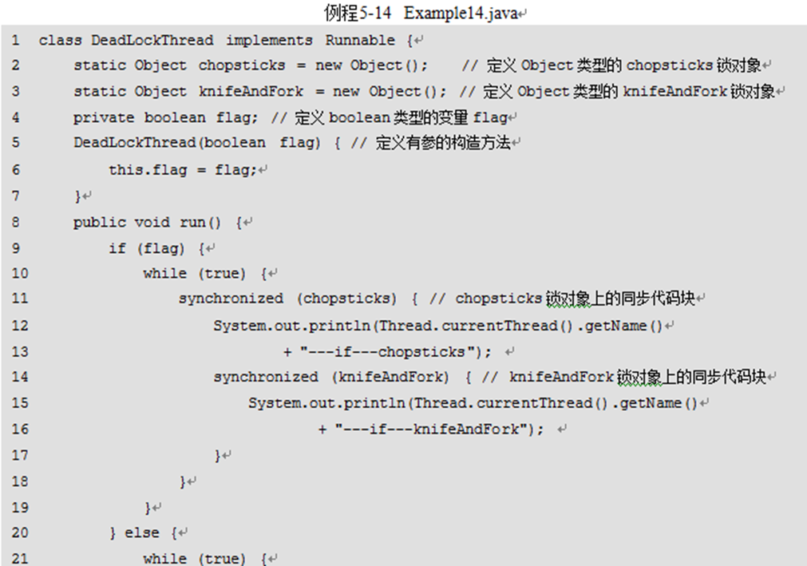
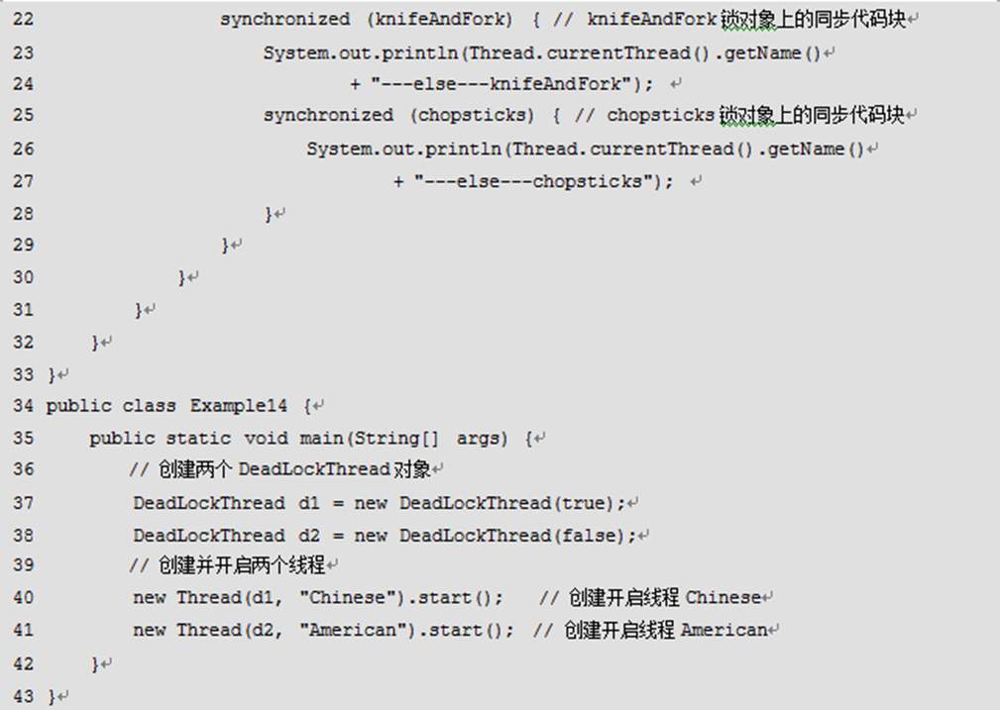

例程5-14中，创建了Chinese和American两个线程，**分别执行run()方法中if和else代码块中的同步代码块**。Chinese线程**先进第一个循环判断**，**拥有chopsticks锁，只有获得knifeAndFork锁才能执行完毕**，而American线程**进入第二个循环**，**拥有knifeAndFork锁，只有获得chopsticks锁才能执行完毕**，两个线程都需要对方所占用的锁，但是都**无法释放自己所拥有的锁，于是这两个线程都处于了挂起状态，从而造成了死锁。**
##5.6 多线程通信
###5.6.1 问题引出
1. 假设有两个线程同时去操作同一个存储空间，其中**一个线程负责向存储空间中存入数据，另一个线程负责则取出数据**。
2. 通过一个案例来实现上述情况，首先**定义一个类**，在**类中使用一个数组来表示存储空间，并提供数据的存取方法**，具体实现如例程5-15所示：
    1. 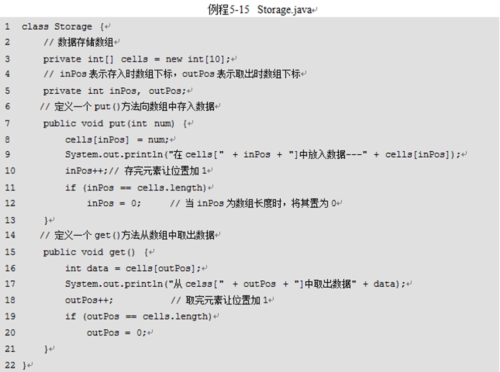
例程5-15中，定义的**数组cells用来存储数据**，**put()方法用于向数组存入数据，get()方法用于获取数据**。针对数组元素的存取操作都是从第一个元素开始依次进行的，**每当操作完数组的最后一个元素时，索引都会被置为0**，也就是**重新从数组的第一个位置开始存取操作**。
    2. 接下来实现两个线程同时访问上例中的共享数据，**这两个线程都需要实现Runnable接口**，具体如例程5-16所示。
    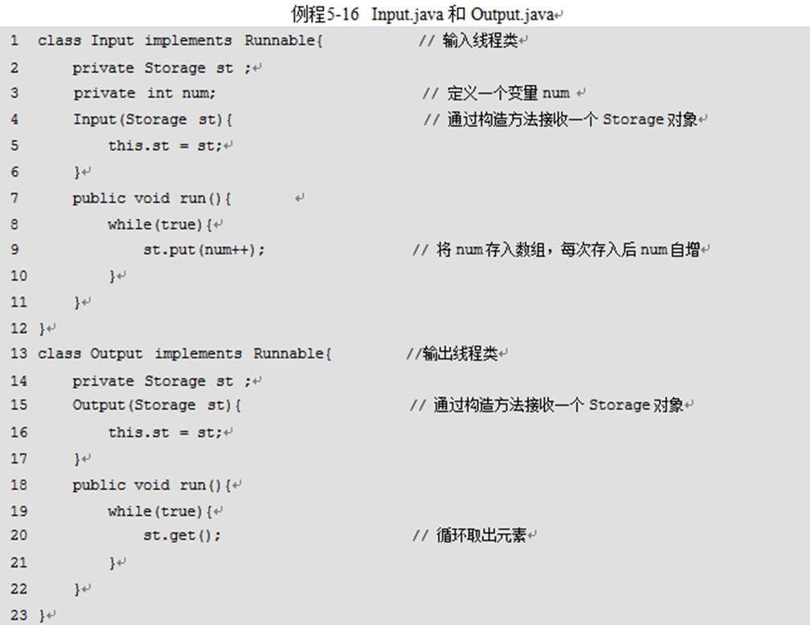
    例程5-16中定义了两个类Input和Output，它们都实现了的Runnable接口，并且**构造方法中都接收一个Storage类型的对象**。在Input类的**run()方法中使用while循环不停地向存储空间中存入数据num，并在每次存入数据后将num进行自增**，从而实现存入自然数1、2、3、4……的效果。**在Output类的run()方法中使用while循环不停地从存储空间中取出数据**。
    3. 最后需要写一个测试程序，开启两个线程分别运行Input和Output类中的代码，如例程5-17所示。
    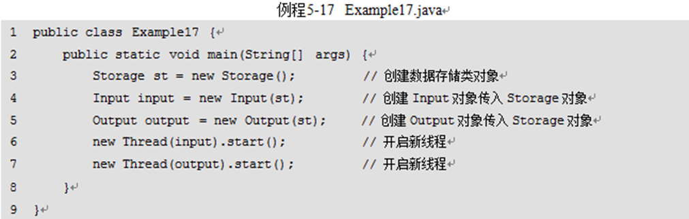
    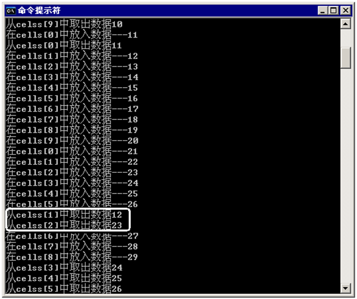
    可以看到，Input线程依次向数组中存入递增的自然数1、2、3、4…..，而Output线程依次取出数组中的数据。**其中特殊标记的两行运行结果表示在取出数字12后，紧接着取出的是23，这样的现象明显是不对的。**我们希望出现的运行结果是依次取出递增的自然数。**之所以出现这种现象是因为在Input线程存入数字13时，Output线程并没有及时取出数据，Input线程一直在持续地存入数据，直到将数组放满，又从数组的第一位置开始存入21、22、23…，当Output线程再次取数据时，取出的不再是13而是23**。

###5.6.2 问题如何解决
如果想解决上述问题，就需要**控制多个线程按照一定的顺序轮流执行，此时需要让线程间进行通信**。在Object类中提供了**wait()、notify()、notifyAll()方法用于解决线程间的通信问题**，由于Java中所有类都是Object类的子类或间接子类，因此**任何类的实例对象都可以直接使用这些方法。**

接下来通过使用wait()和notify()方法，对例程5-15进行改写来实现线程间的通信，如例程5-18所示。
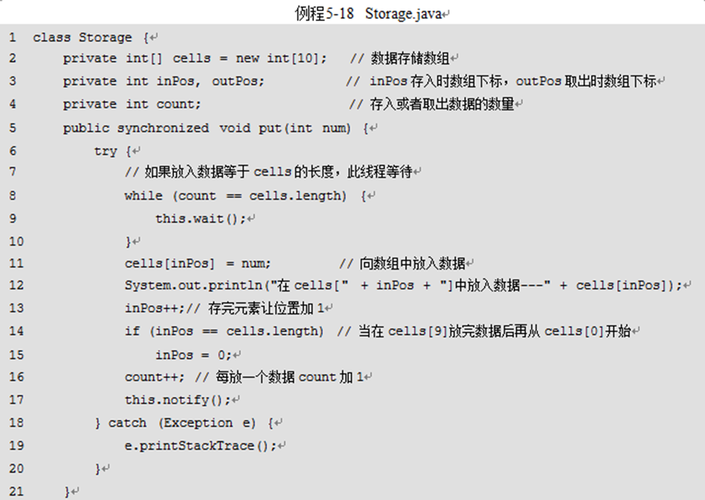

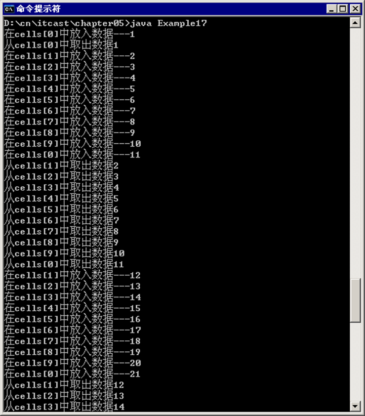
例程5-18的Storage类是对例程5-15的改写，首先通过**使用synchronized关键字将put()方法和get()方法修饰为同步方法**，之后**每操作一次数据，便调用一次notify()方法唤醒对应同步锁上等待的线程**。**当存入数据时，如果count的值与cells数组的长度相同，说明数组已经添满，此时就需要调用同步锁的wait()方法使存入数据的线程进入等待状态**。同理，**当取出数据时如果count的值为0，说明数组已被取空，此时就需要调用同步锁的wait()方法，使取出数据的线程进入等待状态**。从运行结果可以看出，存入的数据和取出的数据都是依次递增的自然数。


##5.7 额外可能考点：
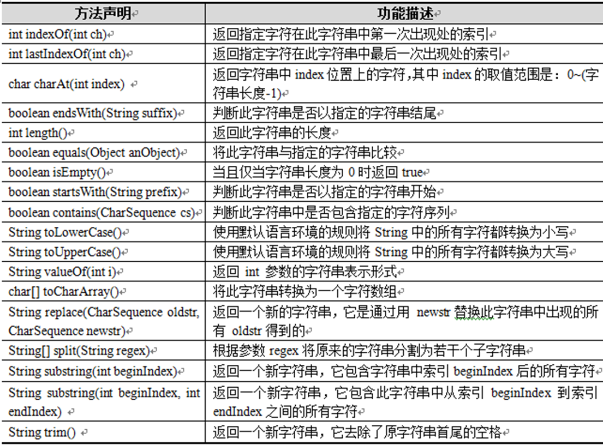