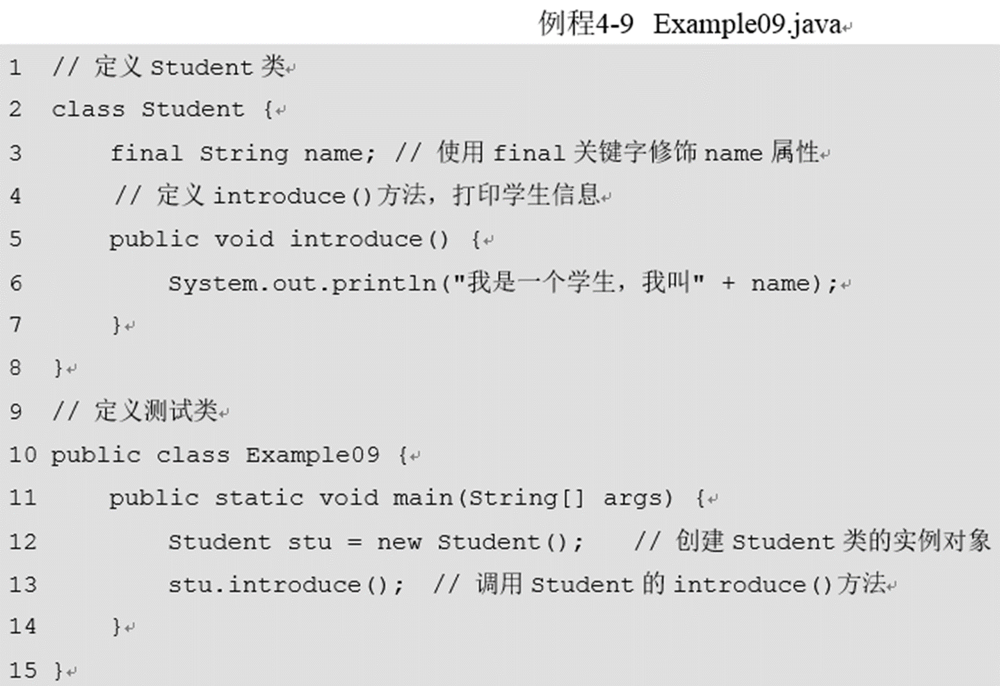

#四、面向对象（下）
##4.1 类的继承
###4.1.1 继承的概念
在Java中，类的继承是指在一个现有类的基础上去构建一个新的类，构建出来的新类被称作子类，现有类被称作父类，子类会自动拥有父类所有可继承的属性和方法。如果想声明一个类继承另一个类，需要使用**extends**关键字。
```
class Animal{
    String name;
    void shout(){
        System.out.println("叫声");
    }
}

class Dog extends Animal{
    public void printName(){
        System.out.println("name=" + name);
    }
}

public class example{
    public static void main(String[] args){
        Dog dog = new Dog();
        dog.name = "哈士奇";
        dog.printName(); //调用dog类的方法
        dog.shout(); //调用dog继承Animal的shout()方法
    }
}
```
### 4.1.2 继承的注意点
1. 在Java中，类只支持**单继承，不允许多重继承**，也就是**一个类只能有一个直接父类！**
2. 多个类可以继承一个父类，**也就是一个父类可以被多个子类继承** 所以父类只能一个，子类可以多个。
3. 多层继承是可以的。**即一个类的父类可以再去继承另外的父类**，例如C类继承自B类，而B类又可以去继承A类，这时，C类也可称作A类的子类。

###4.1.3 重写父类方法
1. 在继承关系中，子类会自动继承父类中定义的方法，但有时在子类中需要对继承的方法进行一些修改，即对父类的方法进行重写。在子类中重写的方法需要和父类被重写的方法具有**相同的方法名、参数列表以及返回值类型。**
例子：
```
class Animal{
    String name;
    void shout(){
        System.out.println("叫声");
    }
}

class Dog extends Animal{
    void shout(){
        System.out.println("汪汪汪");
    }
}

public class example{
    public static void main(String[] args){
        Dog dog = new Dog();
        dog.shout(); //调用dog重写的shout()方法，所以是汪汪汪
    }
}
```
2. 当子类重写父类的方法后，子类对象将无法访问父类被重写的方法。Java中专门提供了一个**super关键字用于访问父类的成员**。例如**访问父类的成员变量、成员方法和构造方法。**
   1. 使用super关键字调用**父类的成员变量和成员方法**

例子：
```
class Animal{
    String name = "动物";
    void shout(){
        System.out.println("叫声");
    }
}

class Dog extends Animal{
    void shout(){
        super.shout();
    }
    void printName(){
        System.out.println("name=" + super.name);
    }
}

public class example{
    public static void main(String[] args){
        Dog dog = new Dog();
        dog.shout(); //调用dog重写的shout()方法，用的是父类的shoutfangfa
        dog.printName(); // 打印父类的名字动物
    }
}
```

2. 使用super关键字调用父类的构造方法。
```
class Animal{
    public Animal(String name){
        System.out.println("我是一只" + name);
    }
}

class Dog extends Animal{
    public Dog(){
        super("狗");
    }
}
public class example{
    public static void main (String[] args){
        Dog dog = new dog(); //会直接调用有参的构造函数，调用Animal的构造函数
    }
}
```
实例化Dog对象时一定会调用Dog类的构造方法，Dog类的构造方法被调用时父类的构造方法也被调用了。
注意的是，**通过super调用父类构造方法的代码必须位于子类构造方法的第一行，并且只能出现一次**。，而且，**子类的构造方法应该与父类构造方法的参数情况一致！** 所以第11行代码去掉，再次编译程序会报错：


进一步说明以上的报错：**在子类的构造方法中一定会调用父类的某个构造方法！** 这时可以在子类的构造方法中**通过super指定调用父类的哪个构造方法**，如果没有指定，在实例化子类对象时，**会自动调用父类无参的构造方法**。

为了解决上述程序的编译错误，
    1. 可以在子类中**显示地调用父类中已有的构造方法**，
    2. 当然也可以**选择在父类中定义无参的构造方法**

```
class Animal{
    public Animal(){
        System.out.println("我是一只动物")
    }

    public Animal(String name){
        System.out.println("我是一只" + name);
    }
}
class Dog extends Animal{
    public Dog(){
    }
}
public class example{
    public static void main (String[] args){
        Dog dog = new dog(); //会直接调用有参的构造函数，调用Animal的构造函数
    }
}
```
这样就不会报错，因为默认调用了父类的无参构造函数，会打印"我是一只动物"

##4.2 final 关键字
final关键字用于修饰类、变量和方法，它有“这是无法改变的”或“最终”的含义
被final修饰的类、变量和方法将具有以下特性：
    1、final修饰的类不能被继承。
    2、final修饰的方法不能被子类重写。
    3、final修饰的变量（成员变量和局部变量）是常量，只能赋值一次。


这是因为Animal类的shout()方法被final所修饰。由此可见，被final关键字修饰的方法为最终方法，子类不能对该方法进行重写。正是由于final的这种特性，当在父类中的定义某个方法时，如果不希望被子类重写，就可以使用final关键字修饰该方法。


这是因为final修饰的变量（成员变量和局部变量）是常量，只能赋值一次。但是使用final关键字修饰成员变量时，虚拟机不会对其进行初始化。因此使用final修饰成员变量时，需要在定义变量的同时赋予一个初始值，下面将第2行代码修改为：
final String name = "李芳"; // 为final关键字修饰的name属性赋值

##4.3 抽象类和接口
###4.3.1 抽象类
1. 当定义一个类时，常常需要**定义一些方法来描述该类的行为特征，但有时这些方法的实现方式是无法确定的。**
2. Java**允许在定义方法时不写方法体，不包含方法体的方法为抽象方法**，抽象方法必须使用**abstract关键字**来修饰

3. 当一个类中包含了抽象方法，**该类必须使用abstract关键字来修饰**，使用abstract关键字修饰的类为抽象类

4. 定义抽象类时需要注意，**包含抽象方法的类必须声明为抽象类**，**但抽象类可以不包含任何抽象方法**，只需使用abstract关键字来修饰即可。
5. **抽象类是不可以被实例化的**，因为抽象类中有可能包含抽象方法，抽象方法是没有方法体的，不可以被调用。**如果想调用抽象类中定义的方法，则需要创建一个子类，在子类中将抽象类中的抽象方法进行实现。**
例子：
```
abstract class Animal{//抽象类不可直接实例化，需要子类实现了抽象方法才能实例化
    abstract void shout();
}
class Dog extends Animal{
    //实现了抽象类的抽象方法shout
    void shout(){
        System.out.println("汪汪！")
    }
}
public class example{
    public static void main(String[] args){
        Dog dog = new Dog();
        dog.shout();
    }
}
```
###4.3.2 接口
1. 一个抽象类中的所有方法都是抽象的，则可以将**这个类用另外一种方式来定义，即接口**。在定义接口时，**需要使用interface关键字来声明**，具体示例如下：
```
interface Animal{
    int ID = 1;
    void breathe();
    void run();
}
```
从示例中会发现抽象方法breathe()并没有使用abstract关键字来修饰，这是因为**接口中定义的方法和变量都包含一些默认修饰符**。

   1. **接口中定义的方法默认使用“public abstract”来修饰，即抽象方法。**
   2. **接口中的变量默认使用“public static final”来修饰，即全局常量。**
****  
2. 接口中的方法都是抽象方法，因此**不能通过实例化对象的方式来调用接口中的方法**。此时**需要定义一个类，并使用implements关键字实现接口中所有的方法。**
```
interface Animal{
    int ID = 1;
    void breathe();
    void run();
}
class Dog implements Animal{
    public void breathe(){
        System.out.println("狗呼吸")；
    }
    public void run(){
        System.out.println("狗在跑");
    }
}
public class example{
    public static void main(String[] args){
        Dog dog = new Dog();
        dog.breathe();
        dog.run();
    }
}
```

3. 在程序中，还可以定义**一个接口使用extends关键字去继承另一个接口**
```
interface Animal{
    int ID = 1;
    void breathe();
    void run();
}

interface LandAnimal extends Animal{
    void liveOnland();
}

class Dog implements LandAnimals{
    public void breathe(){
        System.out.println("狗呼吸")；
    }
    public void run(){
        System.out.println("狗在跑");
    }
    public void liveOnland(){
        System.out.println("狗生活在陆地上");
    }
}
public class example{
    public static void main(String[] args){
        Dog dog = new Dog();
        dog.breathe();
        dog.run();
        dog.liveOnland();
    }
}
```
4. 接口的特点总结
1、接口中的方法都是抽象的，**不能实例化对象**。
2、当一个类实现接口时，**如果这个类是抽象类，则实现接口中的部分方法即可**，否则**需要实现接口中的所有方法**。
3、一个类通过implements关键字实现接口时，**可以实现多个接口**，被实现的**多个接口之间要用逗号隔开**。


5. 一个接口可以通过**extends关键字继承多个接口，接口之间用逗号隔开。**


6. 一个类在**继承另一个类的同时还可以实现接口**。**extends关键字必须位于implements关键字之前**，即**继承在实现之前**。


##4.4 多态
###4.4.1 多态概述
1. 设计一个方法时，通常希望**该方法具备一定的通用性**。在同一个方法中，这种**由于参数类型不同而导致执行效果各异的现象**就是**多态**。
2. 在Java中为了实现多态，**允许使用一个父类类型的变量来引用一个子类类型的对象**，根据**被引用子类对象特征的不同，得到不同的运行结果**。
```
interface Animal{
    void shout();
}
class Cat implements Animal{
    public void shout(){
        System.out.println("喵喵喵");
    }
}
class Dog implements Animal{
    public void shout(){
        System.out.println("汪汪汪");
    }
}
*************
public class Example{
    public static void main(String[] args){
        Animal an1 = new Cat(); //创建Cat对象，用父类类型变量来引用该子类对象
        Animal an2 = new Dog(); //创建Dog对象，用父类类型变量来引用该子类对象 
        animalShout(an1);
        animalShout(an2);
    }
    public static void animalShout(Animal an){
        an.shout(); //调用实际对象的shout
    }
}
*************
```
###4.4.2 对象的类型转换
1. 多态的学习中，涉及到将子类对象当做父类类型使用的情况。

2. 子类对象当做父类使用时不需要任何显式地声明，需要注意的是，此时**不能通过父类变量去调用子类中某些方法**


此时Cat是作为animal父类来引用，因此animal无法调用Cat类的特殊方法sleep
3. 如果Cat要作为animal父类来引用特殊方法sleep，因此需要将输入的Cat类从父类animal强制转化为Cat：


创建Cat类实例化强制转化的animal父类，因此可以调用Cat类的方法
4. 进行类型转换时也可能出现错误，例如在例程4-14中调用animalShout()方法时传入一个Dog类型的对象。无法将Dog类型直接转化为Cat类型。


在调用animalShout()方法时，传入一个Dog对象，在强制类型转换时，Animal类型的变量无法强转为Cat类型。
5. 针对4这种情况，Java提供了一个关键字instanceof，它可以判断一个对象是否为某个类(或接口)的实例或者子类实例。


因此可以排除Dog强制转化为Cat的情况

###4.4.3 Object类
1. 在JDK中提供了一个Object类，**它是所有类的父类，即每个类都直接或间接继承自该类。**


2. 因为**Animal默认继承自Object类**，在**Object类中定义了toString()方法，在该方法中输出了对象的基本信息。**

3. 在实际开发中，**通常希望对象的toString()方法返回的不仅仅是基本信息，而是一些特有的信息**，这时**重写Object的toString()方法便可以实现。**


###4.4.4 匿名内部类
1. 多态的讲解中，如果方法的参数被定义为一个接口类型，那么就需要定义一个类来实现接口，并根据该类进行对象实例化。除此之外，还可以使用**匿名内部类**来实现接口。
```
interface Animal{
    void shout();
}
public class example{
    public static void main(String[] args){
        class Cat implements Animal{
            public void shout(){
                System.out.println("喵喵");
            }
        }
        animalShout(new Cat());//这里相当于创建一个Cat对象，再用父类animal来调用
    }
    public static void animalShout(Animal an){
        an.shout();
    }
}
```

以上写法属于内部类的写法。

以下写法是匿名内部类写法：
```
interface Animal{
    void shout();
}
public class example{
    public static void main(String[] args){
        animalShout(new Animal(){
            public void shout(){
                System.out.println("喵喵喵")
            }
        })
    }
    public static void animalShout(Animal an){
        an.shout();
    }
}
```
分析：
   1. 首先看一下匿名内部类的格式：
 
   1. 在调用animalShout ()方法时，在方法的参数位置写上new Animal (){}， **这相当于创建了一个实例对象，并将对象作为参数传给animalShout ()方法**
   2. new Animal()**后面有一对大括号，表示创建的对象为Animal的子类实例**，该子类是**匿名的**


总之先创建对应抽象类的子类，{}进行描述子类实例

2. 接口在面向对象的设计与编程中应用的非常广泛，特别是实现软件模块间的插接方面有着巨大的优势。


在面向对象的编程语言中，这种限定就是通过接口类来表示的，主板和各种PCI卡就是按照PCI接口进行约定的。

##4.5 异常
###4.5.1 什么是异常
1. 程序运行的过程中，也会发生这种非正常状况，比如程序运行时磁盘空间不足，网络连接中断，被装载的类不存在。针对这种情况，在Java语言中，引入了异常，以异常类的形式对这些非正常情况进行封装。类如


程序发生了算数异常（ArithmeticException），这个异常是由于程序中的第3行代码调用divide()方法时传入了参数0，在方法中的第8行代码的运算中出现了被0除的错误。在这个异常发生后，程序会立即结束，无法继续向下执行。
2. 在例程4-21中产生了一个ArithmeticException异常，ArithmeticException异常只是Java异常类中的一种，在Java中还提供了大量的异常类，这些类都继承自java.lang.Throwable类。
3. Throwable有两个直接子类Error和Exception，其中**Error代表程序中产生的错误**，**Exception代表程序中产生的异常**。接下来就对这两个直接子类进行详细讲解。
    1. Error类称为错误类，它表示Java运行时产生的系统内部错误或资源耗尽的错误，是比较严重的，仅靠修改程序本身是不能恢复执行的。举一个生活中的例子，在盖楼的过程中因偷工减料，导致大楼坍塌，这就相当于一个Error。使用java命令去运行一个不存在的类就会出现Error错误。
    2. Exception类称为异常类，它表示程序本身可以处理的错误，在开发Java程序中进行的异常处理，都是针对Excption类及其子类。在Exception类的众多子类中有一个特殊的RuntimeException类，该类及其子类用于表示运行时异常。Exception类下所有其它的子类都用于表示编译时异常。
    3. Throwable类中的常用方法


###4.5.2 try…catch和finally
1. 例程4-21立即终止，无法继续向下执行。为了解决这样的问题，1由于发生了异常，程Java中提供了一种对异常进行处理的方式——异常捕获。**异常捕获通常使用try…catch语句**。

其中在**try代码块中编写可能发生异常的Java语句**，**catch代码块中编写针对异常进行处理的代码**。当try代码块中的程序发生了异常，**系统会将这个异常的信息封装成一个异常对象，并将这个对象传递给catch代码块**。**catch代码块需要一个形参指明它所能够接收的异常类型**，这个参数的类型必须是**Exception类或其子类**。
```
public class Example{
    public static void main(String[] args){
        try{
            int result = divide(4,0);
            System.out.println(result);
        }
        catch(Exception e){ //对异常进行处理
            System.out.println("捕获的错误:" + e.getMessage());
        }
        System.out.println("继续执行");
    }
    public static int divide(int x, int y){
        int result = x / y;
        return result;
    }
}
```
2. **在try代码块中，发生异常语句后面的代码是不会被执行的**。在程序中，有时候我们希望**有些语句无论程序是否发生异常都要执行**，这时就可以在try…catch语句后，**加一个finally代码块**。
```
public class Example{
    public static void main(String[] args){
        try{
            int result = divide(4,0);
            System.out.println(result);
        }
        catch(Exception e){ //对异常进行处理
            System.out.println("捕获的错误:" + e.getMessage());
            return;
        }
        finally{
            System.out.println("进入final代码块");
        }
        System.out.println("继续执行");
    }
    public static int divide(int x, int y){
        int result = x / y;
        return result;
    }
}
```
注意：
    1. 在使用finally时，**需要先在catch语句里面return**，以结束当前语句。
    2. **finally中的代码块有一种情况下是不会执行的**，那就是在try...catch中执行了**System.exit(0)**语句。System.exit(0)表示退出当前的Java虚拟机，**Java虚拟机停止了，任何代码都不能再执行了**。

###4.5.3 throws 关键字
1. 在前面学习的例程4-23中，由于调用的是自己写的divide()方法，因此很清楚该方法可能会发生异常。试想一下，如果去调用一个别人写的方法时，是否能知道别人写的方法是否会有异常呢？这是很难做出判断的。针对这种情况，**Java中允许在方法的后面使用throws关键字对外声明该方法有可能发生的异常**，这样调用者在调用方法时，就明确地知道该方法有异常，并且**必须在程序中对异常进行处理，否则编译无法通过**。
2. throws关键字声明抛出异常的语法格式如下：

所以以下代码会报错：

这主要是有throws声明，但是并没有在程序中对异常进行处理！
因此需要改成以下代码：
```
public class example{
    public static void main(String[] args){
        try{
            int result = divide(4, 2)
            System.out.println(result);
        }
        catch (Exception e){
            e.printStackTrace();
        }
    }
    public static int divide(int x, int y) thorws Exception {
        int result = x / y;
        return result;
    }
}
```
3. 当在调用divide()方法时，**如果不知道如何处理声明抛出的异常，也可以使用throws关键字继续将异常抛出，这样程序也能编译通过**，但需要注意的是，**程序一旦发生异常，如果没有被处理，程序就会非正常终止**


###4.5.4 运行时异常与编译时异常
在实际开发中，经常会在**程序编译时期产生一些异常，而这些异常必须要进行处理，这种异常被称为编译时期异常，也称为checked异常**。另外还有**一种异常是在程序运行时期产生的，这种异常即使不编写异常处理代码，依然可以通过编译，因此我们称之为运行时异常，也称为unchecked异常**。接下来就分别对这两种异常进行详细的讲解。
1. 编译时异常
    1. 在Java中，**Exception类中除了RuntimeException类及其的子类都是编译时异常**。编译时异常的特点是**Java编译器会对其进行检查，如果出现异常就必须对异常进行处理**，否则程序无法通过编译。
    
    2. 解决办法：1. 使用try…catch语句对异常进行捕获；2. 使用throws关键字声明抛出异常，调用者对其处理。
2. 运行时异常
**RuntimeException类及其子类都是运行时异常**。运行时异常的特点是**Java编译器不会对其进行检查**，也就是说，当程序中出现这类异常时，即使没有使用try..catch语句捕获或使用throws关键字声明抛出，程序也能编译通过。**运行时异常一般是由于程序中的逻辑错误引起的，在程序运行时无法恢复**。比如通过数组的角标访问数组的元素时，如果超过了数组的最大角标(数组越界)，就会发生运行时异常。

###4.5.5 自定义异常
1. JDK中定义了大量的异常类，虽然这些异常类可以描述编程时出现的大部分异常情况，但是在程序开发中有时可能**需要描述程序中特有的异常情况**，例如在设计divide()方法时不允许被除数为负数。为了解决这个问题，在Java中允许用户自定义异常，但**自定义的异常类必须继承自Exception或其子类**

在实际开发中，如果没有特殊的要求，自**定义的异常类只需继承Exception类，在构造方法中使用super()语句调用Exception的构造方法即可**。
既然自定义了异常，那么该如何使用呢？这时就需要用到throw关键字，throw关键字用于在方法中声明抛出异常的实例对象，其语法格式如下：

2. 
divide()方法中判断被除数是否为负数，如果为负数，就是用throw关键字在方法中向调用者抛出自定义的DivideByMinusException异常对象

**从运行结果可以看出，程序在编译时就发生了异常。**这是因为在一个方法内使用throw关键字抛出异常对象时，**需要使用try…catch语句对抛出的异常进行处理**，或者**在divide()方法上使用throws关键字声明抛出异常**，由该方法的调用者负责处理。

因此用try...catch来捕捉异常：


##4.6 包(Package)
### 4.6.1 包的定义与使用
1. 为了便于对硬盘上的文件进行管理，通常都会将文件分目录进行存放。同理，**在程序开发中，也需要将编写的类分目录存放便于管理。**为此，Java引入了包(package)，程序通过声明包的方式对Java类定义目录。
2. **Java中的包是专门用来存放类的**，通常功能相同的类存放在相同的包中。在声明包时，使用package语句，具体示例如下：

包的声明只能位于Java源文件的第一行
3. 编译一个**声明了包的Java源文件，需要使用命令生成与包名对应的目录**，具体示例如下：

其中，“-d”用来指定生成的类文件的位置，“.”表示在当前目录，整行命令表示生成带包目录的.class文件并存放在当前目录下，当然，生成的类文件还可以存放在其它目录下，这时只需要将“.”用其它路径替换即可。

4. 以HelloWorld为例，分步骤讲解如何使用包机制管理Java的类文件。
    1. 编写HelloWorld类，在类名之前声明当前类所在的包为“cn.itcast”
    
    2. 按下回车键，在当前目录下查看包名“cn.itcast”对应的“cn\itcast”目录，发现该目录下存放了HelloWorld.class文件。
    
    3. 使用“java cn.itcast.HelloWorld”命令运行图4-37 所示的class文件，需要注意的是，在运行.class文件时，需要跟上包名，运行结果如图4-38所示。
    

###4.6.2 import语句
在程序开发中，位于不同包中的类经常需要互相调用。例如，目录“D:\packageTest” 下有两个源文件，分别是Student.java和Test.java，如例程4-31和例程4-32所示。


1. 首先需要使用“javac –d . Student.java”编译Student类，编程通过后，会生产“cn.itcast”包，如图4-39所示
   
2. 接下来使用“javac –d . Test.java”命令编译Test.java源文件，这时会编译出错，如图4-40所示。

为了解决图4-40所示的编译错误，将例程4-32的第4行进行修改，修改后代码如下所示：

重新编译Test类，这时编译通过，使用“java cn.itcast.example.Test”命令运行Test类，运行结果如图4-41所示。

3. 为了简化代码，Java中提供了import关键字，使用import可以在程序中一次导入某个指定包下的类，这样就不必在每次用到该类时都书写完整类名了，具体格式如下所示：

import通常出现在package语句之后，类定义之前。接下来对例程4-32修改，修改后的Test类如例程4-33所示。

4. Java的核心类主要放在java这个包以及其子包下，Java扩展的大部分类都放在javax包以及其子包下。Java语言中的常用包：
java.lang:包含Java语言的核心类，如String、Math、System和Thread类等，使用这个包中的类无须使用import语句导入，系统会自动导入这个包下的所有类。
java.util:包含Java中大量工具类、集合类等，例如Arrays、List、Set等。
java.net:包含Java网络编程相关的类和接口。
java.io:包含了Java输入、输出有关的类和接口。
java.awt:包含用于构建图形界面(GUI)的相关类和接口。

###4.6.3 给Java应用打包
1. jar文件的全称是Java Archive File，意思是Java档案文件，它是一种压缩文件，独立于任何操作系统平台，习惯上也将jar文件称为jar包。
2. 在使用jar包时，**只需要在classpath环境变量中包含这个jar文件的路径(配置classpath环境变量请查阅第一章)**，Java虚拟机就能**自动在内存中解压这个jar文件，根据包名所对应的目录结构去寻找所需要的类**。下面通过一个图来形象描述jar包中的内部结构。

3.给Java应用打包有很多好处，接下来简单介绍一下打包jar文件的好处，如下所示：
    1. 安全：可以对jar文件进行数字签名，让能够识别数字签名的用户使用。
    2. 节省空间：当把.class文件打成jar压缩文件，会节省空间，如果将jar文件在网络上传输，也会加快传输速率。
    3. 可移植性：只要有Java虚拟机，jar包就可以在任何平台上运行。
4. 接下来以例程4-30的HelloWorld为例，分步骤学习如何压缩jar文件以及如何运行jar包。
    1. 打开命令提示符，进入D:\cn\itcast\chapter04目录，输入命令
    
    -c代表创建归档的文件
-v代表在标准输出中生成详细输出
-f代表指定归档文件名
    
    2. 用winRAR软件打开helloworld.jar文件，可以看到里面包含了两个目录cn和META-INF，cn目录就是有完整包名的HelloWorld.class文件，META-INF目录下有一个MANIFEST.MF文件，如图4-47所示。
    
    3. 在命令行窗口输入如下命令，运行helloworld.jar文件。
    
    但是在命令行窗口出现了“helloworld.jar中没有主清单属性”错误提示信息，如图4-48所示。
    
    4. 接下来把MANIFEST.MF文件从压缩文件中拉出来，用记事本打开，在已经存在的两行内容下面再增加一行内容：
    
    Main-Class: cn.itcast.HelloWorld这行内容就指定了helloworld.jar文件的主类是cn.itcast.HelloWorld(需要带完整的包名)，然后把MANIFEST.MF文件保存，拖入helloworld.jar的META-INF目录下覆盖原来的MANIFEST.MF文件，然后再次执行java –jar helloworld.jar命令，就得到了HelloWorld类正确的执行结果：
    
    5. 如果想要解压helloworld.jar文件，可以使用如下命令：
    
    从图4-44中可以看到，jar命令的参数-x代表从档案中提取指定的(或所有)文件。这个命令就会把jar包中的cn和META-INF目录解压到当前文件夹。如图4-51和图4-52所示。
    

##4.7 访问控制
在Java中，针对类、成员方法和属性提供了四种访问级别，分别是private、default、protected和public。接下来通过一个图将这四种控制级别由小到大依次列出:

    1. private(类访问级别) ：如果类的成员被private访问控制符来修饰，则这个成员只能被该类的其它成员访问，其它类无法直接访问。实现类的良好封装。
2. default(包访问级别) ：如果一个类或者类的成员不使用任何访问控制符修饰，则称它为默认访问控制级别，这个类或者类的成员只能被本包中的其它类访问。
3. protected(子类访问级别) ：如果一个类的成员被protected访问控制符修饰，那么这个成员既能被同一包下的其它类访问，也能被不同包下该类的子类访问。
4. public(公共访问级别) ：这是一个最宽松的访问控制级别，如果一个类或者类的成员被public访问控制符修饰，那么这个类或者类的成员能被所有的类访问，不管访问类与被访问类是否在同一个包中。


